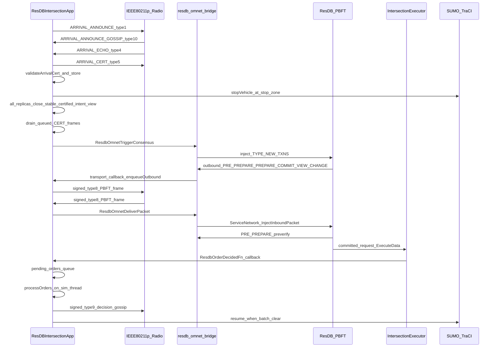

# System Architecture: ResDB-over-Veins V2V Intersection Coordination

This is the current architecture handoff for the V2V intersection coordination system. The runnable codebase now uses the C++ ResilientDB integration; the old Java/BFT-SMaRt/JNI implementation has been removed from the active source tree.

The canonical runtime path is:

```text
OMNeT++ / Veins vehicle app
  -> ResDBIntersectionApp C++ arrival-cert protocol
  -> ResilientDB PBFT through resdb_omnet_bridge
  -> 802.11p radio frames for all inter-vehicle traffic
  -> direct C++ order callback
  -> TraCI vehicle control
```

There is no Java or JNI consensus path on the current hot path. Archived migration docs may still mention BFT-SMaRt/JNI as historical reference material, especially for the original arrival protocol, conflict matrix, verifier semantics, and leader-change research, but those files are not part of the build or runtime.

---

## 1. Core Invariants

1. **Each vehicle is one PBFT replica.** `veh0` maps to ResDB replica `0`, `veh1` to replica `1`, and so on. ResDB's internal config still uses 1-based node ids, so the bridge translates between ResDB node id `N+1` and OMNeT replica id `N`.

2. **All inter-vehicle protocol traffic uses the Veins 802.11p radio model.** Arrival messages, ResDB PBFT bytes, view-change traffic, and decision gossip are carried as `BFTMessage` frames. ResDB is socketless in simulation mode.

3. **OMNeT++ owns simulated time.** `ResDBIntersectionApp` periodically calls `ResdbOmnetUpdateSimTimeUs()`. ResDB worker threads read `SimTimeProvider::NowUs()` and wait through `SimTimeProvider::SleepForUs()` / `SleepUntilUs()`.

4. **OMNeT++ simulation APIs are used only on the simulation thread.** ResDB worker threads enqueue outbound packets and committed orders. `ResDBIntersectionApp` drains those queues from self-messages.

5. **Discovery completes locally before ORDER consensus.** Every replica runs the same view-based discovery state machine. Physical arrival, lane verification, echo collection, and `ARRIVAL_CERT` validation happen in Veins C++ before the elected discovery primary submits `ResdbProposeHdr + ResdbVehicleEntry[]` to PBFT.

6. **Consensus decides an order, not movement directly.** ResDB commits binary order bytes. `ResDBIntersectionApp::processOrders()` applies the order, waits for preceding batches to clear through TraCI, and then resumes the vehicle.

7. **Type 9 is now decision gossip.** In the legacy Java path, type 9 carried Java client-request broadcasts. In the current ResDB path, type 9 carries signed post-consensus order gossip so stragglers can catch up after missing the PBFT storm.

8. **Type 10 is arrival-announce gossip.** Replicas that verify an `ARRIVAL_ANNOUNCE` may relay the original announcement bytes through the existing signed gossip wrapper. The relayer signs only the outer carrier frame; the inner announcement remains the originating vehicle's byte-for-byte payload.

---

## 2. High-Level Node Model

Each simulated vehicle runs one `ResDBIntersectionApp` module. That module owns the vehicle's interaction with SUMO/TraCI, V2V arrival certificates, ResDB bridge lifecycle, radio transport, order delivery, and post-consensus gossip.

```text
Vehicle node i
|
+-- ResDBIntersectionApp
|   |
|   +-- TraCI helpers
|   |   +-- lane discovery
|   |   +-- stop-line distance
|   |   +-- stop / resume vehicle
|   |   +-- intersection-clearance checks
|   |
|   +-- Arrival certificate protocol
|   |   +-- ARRIVAL_ANNOUNCE type 1
|   |   +-- ARRIVAL_ANNOUNCE_GOSSIP type 10
|   |   +-- ARRIVAL_ECHO type 4
|   |   +-- ARRIVAL_CERT type 5
|   |
|   +-- ResDB bridge handle
|   |   +-- socketless ServiceNetwork
|   |   +-- OmnetConsensusManagerPBFT
|   |   +-- IntersectionExecutor
|   |   +-- order callback
|   |
|   +-- Radio transport
|   |   +-- outbound ResDB queue from worker threads
|   |   +-- signed type 8 PBFT radio frames
|   |   +-- inbound type 8 delivery to ResDB
|   |
|   +-- Decision gossip
|       +-- signed type 9 order broadcast
|       +-- f+1 matching gossip votes to apply missed order
|
+-- Veins NIC / 802.11p channel
```

The ResDB library still runs internal worker threads, but all interaction with Veins is mediated by the C bridge and callback queues. The app never includes internal ResDB C++ headers directly; it includes only `integration/omnet/resdb_omnet_bridge.h`.

---

## 3. Main Component Inventory

| File | Role |
|------|------|
| `veins-veins-5.3.1/src/veins/modules/application/resDB/ResDBIntersectionApp.h` | Main Veins app declaration. Defines phases, Byzantine modes, arrival-cert structs, transport queues, timers, gossip state, TraCI state, and ResDB callback hooks. |
| `veins-veins-5.3.1/src/veins/modules/application/resDB/ResDBIntersectionApp.cc` | Main app implementation. Owns initialization, timers, radio receive dispatch, arrival protocol, ResDB transport drain, `proposeAll()`, order processing, gossip, and fault injection. |
| `veins-veins-5.3.1/src/veins/modules/application/resDB/ResDBIntersectionApp.ned` | NED parameters for replica identity, ResDB paths, radio transport, jitter, cert timeout, gossip, view-change timeout, Byzantine injection, and TraCI behavior. |
| `veins-veins-5.3.1/src/veins/modules/application/resDB/IV2VTransport.h` | Minimal abstract transport interface. Provides C-compatible adapters for the bridge callback table. |
| `veins-veins-5.3.1/src/veins/modules/application/resDB/ResdbV2VWire.h` | Shared signed-envelope helper for type 8, type 9, and type 10 radio payloads. Layout is pubkey, signature length, DER ECDSA signature, then inner bytes. |
| `veins-veins-5.3.1/src/veins/modules/application/resDB/ResDBDecisionGossip.h/.cc` | Pure relay-dedup logic for three independent mechanisms: (1) decision gossip — serializes `epoch \|\| order_bytes`, parses TYPE9 payloads, counts matching votes per sender via `GossipAccumulator`; (2) cert relay — `CertRelayTracker` deduplicates per-carId ARRIVAL_CERT re-floods so each node relays each validated cert exactly once; (3) announce gossip — serializes `epoch \|\| original_announce_bytes` and deduplicates per `(epoch, carId)` through `AnnouncementRelayTracker`. |
| `veins-veins-5.3.1/src/veins/modules/application/resDB/ResDBRollbackProtocol.cc` | CANCEL protocol module. Owns type 12 cancel echoes, type 13 cancel certs, local halt, CANCEL draining/consensus, post-CANCEL round setup, epoch tombstones, and retry/relay state. Discovery itself remains in `ResDBArrivalProtocol.cc`. |
| `veins-veins-5.3.1/src/veins/modules/application/resDB/ResDBTraCI.cc` | TraCI helpers extracted from the legacy V2V module: distance-to-lane-end, lane queue discovery, vehicle stop/resume helpers, and clearance detection. |
| `veins-veins-5.3.1/src/veins/modules/application/resDB/crypto/CryptoAuth.h/.cc` | OpenSSL ECDSA P-256 helper. Generates per-vehicle EC keys, signs arbitrary byte buffers, verifies signatures, and contains CA certificate helpers. |
| `incubator-resilientdb/integration/omnet/resdb_omnet_bridge.h` | C ABI between Veins and ResDB. Defines lifecycle, transport callback registration, sim-time update, consensus trigger, order callback, cert-primary/PBFT primary alignment, view-change hooks, and shared packed structs. |
| `incubator-resilientdb/integration/omnet/resdb_omnet_bridge.cc` | ResDB-side integration. Builds socketless PBFT service, installs OMNeT communicator, registers pre-verify function, hosts `IntersectionExecutor`, injects inbound packets, and exposes the C API. |
| `incubator-resilientdb/platform/consensus/ordering/pbft/omnet_forced_view.h` | Header-only rollback active-view registry. Stores request-scoped, proposal-defined rollback membership `M`, quorum `2f+1`, forced primary, and sender-admission helpers for PBFT. |
| `incubator-resilientdb/common/utils/sim_time_provider.h/.cpp` | Global simulated-time provider used by ResDB worker threads. Updated by the OMNeT simulation thread. |

---

## 4. End-to-End Flow



The key split is between ResDB worker threads and the OMNeT++ simulation thread. Worker threads may call transport callbacks and order callbacks. Those callbacks only enqueue data. Self-messages (`transport_poll_msg_`, `time_tick_msg_`, `clearance_poll_msg_`, and others) do the actual simulation work.

---

## 5. Runtime Lifecycle

### Stage 0 initialization

`ResDBIntersectionApp::initialize(stage == 0)` performs the system-level setup:

1. Reads NED parameters: replica id, total vehicles, ResDB config paths, radio settings, timeout settings, Byzantine mode, gossip settings, and TraCI behavior.
2. Binds `replicaId_` to the SUMO external id when possible. This keeps the PBFT replica id aligned with the SUMO vehicle id (`vehN`).
3. Generates the vehicle's ECDSA P-256 keypair through `CryptoAuth::generateKeyPair()`.
4. Creates either `VeinsTransport` or `LoggingTransport`.
5. Creates a real ResDB server handle with `ResdbOmnetCreateKvServer()` when config paths are present; otherwise creates a null handle.
6. Registers transport callbacks through `ResdbOmnetSetTransport()`.
7. Registers the order callback through `ResdbOmnetSetOrderCallback()`.
8. Registers the cert-snapshot callback through `ResdbOmnetSetCertSnapshotFn()` — enables pre-verify Checks 9 and 10.
9. Configures the PBFT view-change timeout through `ResdbOmnetSetVcTimeoutUs()`.
10. Starts sim-time ticking through `ResdbOmnetUpdateSimTimeUs()`.
11. Runs the socketless ResDB server thread through `ResdbOmnetRunServer()`.
12. If `BYZANTINE_SILENT_PRIMARY` is enabled, calls `ResdbOmnetSetPbftSilent()` after the server starts.

### Stage 1 initialization

`initialize(stage == 1)` schedules the simulation behavior:

1. Optional smoke test for transport callbacks.
2. Staggered initial arrival announcement at `triggerJoinTimeSec + replicaId * arrivalSlotSec`.
3. Periodic arrival announcements until the car has broadcast its certificate or consensus starts.
4. Optional channel/SINR CSV metrics sampling.

### Teardown

`finish()` advances ResDB sim-time to a very large value before stopping the server. This wakes ResDB threads blocked in simulated sleeps. It then stops global stats, cancels VC timers, stops and destroys the ResDB handle, and tears down channel metrics.

---

## 6. V2V Message Type Registry

All inter-vehicle traffic is carried in `BFTMessage` packets over the Veins 802.11p channel.

| Type | Name | Current meaning | Payload |
|------|------|-----------------|---------|
| `1` | `ARRIVAL_ANNOUNCE` | Vehicle announces physical arrival, lane, position, direction, ambulance flag, epoch, and self-signature. | Text/pipe encoded arrival announcement plus signature bytes. |
| `4` | `ARRIVAL_ECHO` | Witness echo for a target car after TraCI verification. Currently broadcast at the MAC layer and filtered logically. | Text/pipe encoded echo with signer's compressed P-256 pubkey and ECDSA signature. |
| `5` | `ARRIVAL_CERT` | Vehicle broadcasts f+1 collected echoes as a participation certificate. | Text/pipe encoded cert with echo signer ids, pubkeys, and signatures. |
| `8` | ResDB PBFT bytes | ResDB PRE_PREPARE, PREPARE, COMMIT, VIEW_CHANGE, NEW_VIEW, and related PBFT traffic. | `resdbwire` signed wrapper around serialized ResDB bytes. |
| `9` | Decision gossip | Post-consensus order dissemination for stragglers that missed PBFT delivery. | `resdbwire` signed wrapper around `epoch || order_bytes`. |
| `10` | Arrival announce gossip | Relay of an already-signed `ARRIVAL_ANNOUNCE` by a witness or carrier replica. | `resdbwire` signed wrapper around `epoch || original ARRIVAL_ANNOUNCE bytes`. |
| `11` | ResDB consensus relay | Re-flood of selected raw ResDB PBFT bytes through the existing signed carrier. | `resdbwire` signed wrapper around `epoch || raw ResDB bytes`. |
| `12` | `CANCEL_ECHO` | Witness attests that epoch `e` should be cancelled for a verified emergency or crash reason. | Text/pipe encoded cancel echo with signer's compressed P-256 pubkey and ECDSA signature. |
| `13` | `CANCEL_CERT` | f+1 collected `CANCEL_ECHO`s for epoch `e`; valid receivers halt locally and enter the CANCEL drain/consensus state machine. Discovery for `e+1` starts only after CANCEL commits. | Text/pipe encoded cancel cert carrying echo signer ids, pubkeys, and signatures. |

Important legacy note: type `9` used to mean Java/BFT-SMaRt client-request broadcast in the JNI architecture. In the current ResDB architecture it is not a client request; it is post-consensus decision gossip.

---

## 7. Wire Formats

### Signed radio wrapper for type 8, type 9, and type 10

Defined in `ResdbV2VWire.h`:

```text
[33 bytes sender_pub_key_compressed]
[1 byte  sig_len]
[sig_len bytes DER ECDSA_SHA256(signature over inner bytes)]
[inner bytes]
```

For type `8`, inner bytes are serialized ResDB network bytes. For type `9`, inner bytes are decision-gossip bytes. For type `10`, inner bytes are announce-gossip bytes.

Inbound type `8`, type `9`, and type `10` messages are dropped if:

1. The signed packet cannot be parsed.
2. The inner byte length is zero.
3. `CryptoAuth::verifyBytes(pubKey, innerBytes, sig)` fails.

The wrapper proves that the inner bytes were signed by the included P-256 public key. The current code does not maintain a separate pubkey-to-replica registry, so this is an integrity check for the radio envelope rather than a complete identity-binding layer. ResDB's built-in node signature verifier is disabled in the simulation bridge because the bridge uses this P-256 wrapper and socketless injection instead.

For type `10`, this outer signature authenticates the carrier frame, not the original vehicle. The carried announcement bytes are not rewritten. They remain the exact `ARRIVAL_ANNOUNCE` payload produced by the origin vehicle, including its self-signature and claimed fields.

### Consensus proposal payload

Defined in `resdb_omnet_bridge.h` and passed to `ResdbOmnetTriggerConsensus()`:

```c
#pragma pack(push, 1)
typedef struct ResdbVehicleEntry {
    int32_t  replica_id;
    uint64_t sim_time_us;
    uint8_t  is_ambulance;
    uint8_t  lane;
    uint8_t  direction;
    uint8_t  position_in_lane;
    uint8_t  cyber_status;
} ResdbVehicleEntry;  // 17 bytes

typedef struct ResdbProposeHdr {
    uint32_t epoch;
    int32_t  leader_id;
    uint64_t propose_sim_time_us;
    uint32_t n_vehicles;
} ResdbProposeHdr;  // 20 bytes
#pragma pack(pop)
```

The full proposal is:

```text
ResdbProposeHdr
ResdbVehicleEntry[hdr.n_vehicles]
```

Field semantics:

| Field | Meaning |
|-------|---------|
| `replica_id` | Vehicle/replica id, 0-based. |
| `sim_time_us` | Sim-time when the vehicle entered the stop zone or was observed. `UINT64_MAX` marks a QUIET synthetic entry. |
| `is_ambulance` | `1` for ambulance priority, `0` otherwise. Current announce path still trusts this flag from the arrival announcement. |
| `lane` | `0=N`, `1=S`, `2=E`, `3=W`. |
| `direction` | `0=Straight`, `1=Left`, `2=Right`. |
| `position_in_lane` | `1` is the front vehicle in its lane. Larger values are farther back. |
| `cyber_status` | `1=SIGNED` when an f+1 arrival cert exists. `0=QUIET` when no f+1 cert was available by proposal time. |

### Order decision payload

Defined in `resdb_omnet_bridge.h` and delivered through `ResdbOrderDecidedFn`:

```c
#pragma pack(push, 1)
typedef struct ResdbVehicleDecision {
    int32_t  replica_id;
    uint32_t batch_index;
} ResdbVehicleDecision;  // 8 bytes

typedef struct ResdbOrderHdr {
    uint32_t epoch;
    uint32_t n_vehicles;
    uint32_t n_batches;
} ResdbOrderHdr;  // 12 bytes
#pragma pack(pop)
```

The full order is:

```text
ResdbOrderHdr
ResdbVehicleDecision[hdr.n_vehicles]
```

`batch_index` is 0-based. Vehicles with the same `batch_index` may cross together. Vehicles in batch `k > 0` wait until all vehicles in batch `k - 1` have cleared the conflict region according to TraCI.

### Decision gossip payload

Defined in `ResDBDecisionGossip.h/.cc`:

```text
uint32_t epoch
uint8_t  order_bytes[]
```

The gossip payload is then wrapped in the same `resdbwire` signed wrapper used by type `8`.

### Arrival announce gossip payload

Defined in `ResDBDecisionGossip.h/.cc`:

```text
uint32_t epoch
uint8_t  original_arrival_announce_bytes[]
```

The original announce bytes are copied unchanged from the type `1` payload. `ResDBIntersectionApp::sendArrivalAnnouncementGossipPayload()` wraps these inner bytes in `resdbwire::packSignedPacket()` before sending type `10`.

---

## 8. Arrival Certificate Protocol

The arrival-cert protocol is the physical-world firewall before PBFT. It proves that a vehicle was observed by enough independent replicas before the cert-primary can schedule it as SIGNED.

### Discovery round state machine

Initial discovery and discovery after a committed CANCEL use the same states and completion rule:

```text
INACTIVE
  -> COLLECTING
  -> DRAINING_CERTS
  -> COMPLETE
  -> INACTIVE when ORDER applies, the vehicle departs, or a newer round starts
```

- `COLLECTING` accepts and transmits ANN, ANN gossip, ECHO, and CERT traffic. Discovery begins while the vehicle approaches the intersection.
- The stop zone arms the hard `cert_collection_timeout_` deadline and the intent-settle timer. Post-CANCEL participants are already stopped, so both timers arm immediately.
- `observed_intent_cars_` contains validated network intent, not an independent physical census. A normal close therefore requires no new eligible intent for `discoveryIntentSettleSec`, at least one eligible intent, the recallable local vehicle's intent, and a valid cert for every eligible intent.
- The hard deadline closes an incomplete view when an announced vehicle is Byzantine, crashed, or unreachable. Only observed uncertified intents become QUIET; unobserved configured replica IDs are not synthesized into membership.
- `DRAINING_CERTS` stops ANN/ECHO production and removes queued non-CERT discovery frames. Queued CERTs remain. A replica cannot enter `COMPLETE` until its assembled local cert has actually reached the radio and all queued cert frames for the round have drained.
- A newly accepted eligible ANN before proposal submission reopens `COLLECTING`, restarts stabilization, and cancels the follower leader-timeout.
- `COMPLETE` lets the elected primary call `proposeAll()` and lets followers arm `vc_trigger_msg_`. PBFT TYPE8/TYPE11 traffic is verified and delivered to ResDB but does not alter discovery state or cancel discovery traffic.

The primary's PRE_PREPARE is therefore not the discovery-closure event. Every follower reaches closure from its own stabilized, certified intent view.

### Phase A: Arrival announcement

Each vehicle periodically broadcasts `ARRIVAL_ANNOUNCE` (`messageType = 1`) until it has broadcast its cert or consensus has started.

The announcement contains:

```text
carId
laneId
cardinal lane
positionInLane
direction
isAmbulance
claimedArrivalTime
epoch
ambulanceCertBytes
ambulanceSigBytes
self signature
```

The self-signature covers:

```text
carId:laneId:positionInLane:claimedArrivalTime:epoch
```

The current wire format carries this self-signature, but the receive path does not use it as the main admission check. Witnesses decide whether to echo based on TraCI lane verification.

### Phase B: Witness echo

When a replica receives an announcement:

1. It ignores departed/zombie vehicles.
2. It parses the announcement.
3. It checks whether it has already verified and echoed the car.
4. It calls `verifyCarPosition(carId, laneId, positionInLane, tolerance)` using TraCI.
5. If the car is physically present but lying about lane, the receiver records the car but does not echo.
6. If verification passes, it stores a `VehicleState`, records observed intent, stores the original announce bytes for possible custody relay, broadcasts an `ARRIVAL_ECHO`, and may gossip the announcement.

The echo signature covers:

```text
carId:lane:positionInLane:direction:isAmbulance:echoingReplicaId
```

Each echo includes the signer's compressed P-256 public key and DER ECDSA signature.

### Announce gossip and custody relay

Announce gossip closes a topology gap where a late-arriving vehicle can directly reach only a small witness set. A witness that hears and verifies that vehicle can carry the original announcement outward so replicas outside the origin vehicle's current radio range can still echo it.

The flow is:

```text
veh18 -> ARRIVAL_ANNOUNCE type 1
replica 4 verifies with TraCI
replica 4 -> ARRIVAL_ECHO for veh18
replica 4 -> ARRIVAL_ANNOUNCE_GOSSIP type 10 carrying veh18's original announce bytes
replica 9 receives type 10
replica 9 reconstructs a synthetic ARRIVAL_ANNOUNCE message
replica 9 runs the normal handleArrivalAnnouncement path
replica 9 verifies with TraCI
replica 9 -> ARRIVAL_ECHO for veh18
```

Security boundary:

- The relayer signs only the outer type `10` carrier frame.
- The inner announcement bytes remain the exact type `1` payload from the origin vehicle.
- A Byzantine carrier can drop, delay, or replay within dedup limits, but cannot modify the original announcement and still preserve the origin vehicle's self-signature.
- Honest recipients still run `verifyCarPosition()` before echoing, so a relayed announce is not accepted merely because a carrier gossiped it.

Implementation:

- `gossipArrivalAnnouncement()` deduplicates immediate announce gossip with `AnnouncementRelayTracker::tryRelay(epoch, carId)`.
- `sendArrivalAnnouncementGossipPayload()` signs and broadcasts the type `10` carrier packet. It is used both by immediate verified gossip and delayed custody replay.
- `handleArrivalAnnouncementGossip()` verifies the carrier wrapper, parses `epoch || original_announce_bytes`, creates a temporary `BFTMessage`, and calls `handleArrivalAnnouncement(..., viaGossip=true, carrierReplicaId=...)`.
- `pending_relays_` is an app-local map keyed by `(epoch, carId)` that stores original announce bytes after successful verification.
- When a vehicle enters the stop zone, it flushes pending announce relays as proper signed type `10` packets with reason `stop-zone`, then clears the custody map.

This relay is intentionally not a new consensus rule. It only improves witness discovery before cert assembly. Echo dedup still prevents repeated echoes from the same replica for the same car.

### Phase C: Arrival certificate

The target vehicle collects echoes for itself. Once it has at least `f + 1` distinct echoes, where `f = (N - 1) / 3`, it assembles and broadcasts an `ARRIVAL_CERT` (`messageType = 5`).

Every receiver validates the cert before storing it:

1. The cert must contain at least `f + 1` echoes.
2. Echo signers must be distinct.
3. Each echo signature must verify against the embedded signer pubkey.
4. The signed string must match the cert's car, lane, position, direction, ambulance flag, and echoing replica id.

If validation passes, the receiver stores `collected_certs_[carId] = cert`.

### Certificate retries

If enabled by `enableArrivalCertRetries`, a vehicle rebroadcasts its assembled cert every `arrivalCertRetryIntervalSec` while discovery is collecting. During `DRAINING_CERTS`, future retries stop after the local cert's first successful air transmission; already queued CERT frames still flush. Retries also stop when:

1. `arrivalCertRetryMax` is reached, unless `0` means unlimited.
2. `proposeAll()` runs.
3. An order is applied.
4. the discovery round becomes inactive.

This improves visibility of type `5` certificates without adding TCP-like ACK machinery.

### Epidemic cert relay

Source-only cert retries can fail if a straggler misses every retry window from the original sender. To close this gap, each replica that receives and validates a cert for a given `carId` re-floods that cert **once**, giving epidemic propagation without source spam.

Implementation:

- `CertRelayTracker` in `ResDBDecisionGossip.h/.cc` tracks which `carId` values this node has already relayed. `tryRelay(carId)` returns `true` the first time and `false` on all subsequent calls.
- `handleArrivalCert()` calls `cert_relay_tracker_.tryRelay(cert.carId)` after validation and state reconstruction. On first receipt, it calls `sendBFTMessage(-1, serializeArrivalCert(cert), kArrivalCertType)` and logs `[CERT-RELAY]`.
- The relay fires immediately on the simulation thread — no additional timer. Natural topology-induced arrival stagger provides spread without synchronized floods.
- `cert_relay_tracker_.reset()` is called in `applyGossipOrder()` alongside `gossip_acc_.reset()`.

The acceptance rule differs from decision gossip. Decision gossip requires `f + 1` matching votes before acting. Cert relay fires as soon as `validateArrivalCert()` passes, because the cert already carries `f + 1` independent ECDSA echo signatures. Any node that validates it can safely relay it with no further quorum check.

Source retries (`enableArrivalCertRetries`) are kept. Relay is additive: it covers the case where the original sender's retry window closes before a straggler node gets coverage.

### QUIET entries

If the hard discovery deadline is reached with an observed intent lacking a valid cert, the primary includes that observed vehicle as QUIET:

```text
sim_time_us = UINT64_MAX
cyber_status = 0
is_ambulance = 0
direction = 0
```

Lane and position come from the locally verified `VehicleState`; direction remains unknown because it is cert-only cyber state. Unobserved configured replicas are excluded. QUIET vehicles are isolated by the executor into singleton batches.

### Cert-primary selection

Normal proposal leadership is derived from the current arrival-cert set, not from the static `leaderReplicaId` ini default. `ResDBIntersectionApp::CertPrimary()` returns the smallest eligible replica id in `collected_certs_`:

```text
CertPrimary = min { rid | collected_certs_ contains veh<rid>, 0 <= rid < totalVehicles }
```

If no static cert exists, no node proposes. Nodes continue arrival announcement gossip, cert retries, and timer rechecks until at least one static cert is known.

This means a Byzantine replica 0 that never forms a cert is not selected as the initial proposer. A node that knows a lower certified id than itself behaves as a follower for that local run. If cert visibility is temporarily split, bridge pre-verify prevents a proposal from a higher id from committing at any follower that already holds a lower cert.

---

## 9. ResDB Bridge and Socketless PBFT

The C bridge is the only dependency boundary between Veins and ResDB. Veins includes `resdb_omnet_bridge.h` and calls C functions. Internal ResDB C++ headers stay on the ResDB side.

### Server creation

`ResdbOmnetCreateKvServer()`:

1. Loads ResDB config, private key, and cert paths.
2. Disables heartbeat.
3. Disables ResDB's built-in signature verifier.
4. Creates `OmnetConsensusManagerPBFT`.
5. Installs the PRE_PREPARE pre-verify lambda.
6. Creates `ServiceNetwork` with `enable_network_acceptor = false`.
7. Activates `SimTimeProvider` with a non-zero sentinel.
8. Stores pointers to the consensus manager and `IntersectionExecutor` in `ResdbOmnetServerHandle`.

Because `ServiceNetwork` has no acceptor, ResDB does not bind real sockets for consensus traffic in the simulation path.

### Transport callbacks

`ResDBIntersectionApp::registerTransport()` fills:

```c
ResdbOmnetTransportCallbacks {
    send_to,
    broadcast,
    ctx
}
```

The bridge's `OmnetReplicaCommunicator` calls those callbacks whenever ResDB wants to send PBFT messages. In the radio-backed path, the callback object is `VeinsTransport`, which calls `ResDBIntersectionApp::enqueueOutbound()`.

### Outbound radio path

ResDB worker thread:

```text
PBFT sends protobuf message
  -> OmnetReplicaCommunicator serializes ResDBMessage
  -> transport callback
  -> ResDBIntersectionApp::enqueueOutbound()
```

OMNeT simulation thread:

```text
transport_poll_msg_
  -> drainOutboundQueue()
  -> resdbwire::packSignedPacket()
  -> BFTMessage type 8
  -> sendDelayedDown()
```

`enqueueOutbound()` deduplicates identical outbound byte strings. This matters because some ResDB send paths call per-recipient send functions for the same logical broadcast. In the V2V model, identical per-recipient sends collapse to one broadcast frame.

Because the radio does not provide perfect links, each replica also keeps bounded retry state for its own PBFT phase packet:

- PRE_PREPARE retries stop after verified PREPARE progress is observed.
- PREPARE retries continue until that replica's local ResDB emits COMMIT. They may also stop after the local verified collector contains a matching `2f+1` COMMIT certificate; merely overhearing one COMMIT is insufficient.
- COMMIT retries continue until the decision is applied/adopted or `consensusRetryMax` is reached.

Before any locally triggered proposal enters `TYPE_NEW_TXNS`, the bridge calls `EnsureNextSeqAheadOfExecuted()`. This advances the new primary's allocator to at least `max(local executed sequence, checkpoint last commit) + 1`. It is necessary when deterministic application leadership moves from the previous PBFT primary to a follower; it does not infer epoch from sequence or assume ORDER/CANCEL alternation.

### Inbound radio path

```text
onWSM()
  -> filter messageType == 8
  -> parse signed wrapper
  -> verify P-256 signature
  -> ResdbOmnetDeliverPacket(handle, fromReplicaId, innerBytes)
  -> ServiceNetwork::InjectInboundPacket()
  -> normal ResDB ConsensusManager::Process() path
```

### Self-injection

`OmnetReplicaCommunicator::SendMessage()` also self-injects broadcast bytes into the local `ServiceNetwork`.

This is required because real TCP deployments count a replica's own votes, while the Veins MAC path filters self-broadcasts. Without self-injection, a replica can miss its own PREPARE/COMMIT contribution and stall below the `2f + 1` quorum.

### PBFT silent mode

`ResdbOmnetSetPbftSilent()` toggles `OmnetReplicaCommunicator::SetPbftSilent()`. When enabled, the node drops all outbound PBFT messages. This is used by the `BYZANTINE_SILENT_PRIMARY` fault to force followers into complaint/view-change behavior.

---

## 10. PRE_PREPARE Pre-Verify

The bridge registers a `SetPreVerifyFunc` lambda inside `ResdbOmnetCreateKvServer()`. This runs on every follower's ResDB worker thread for each incoming PRE_PREPARE, before the follower sends a PREPARE vote. If any check fails the PRE_PREPARE is rejected, which feeds into ResDB's built-in view-change machinery.

The ResDB consensus engine itself is **not modified**. `SetPreVerifyFunc` is an existing ResDB hook; all logic is in the bridge layer.

### Structural checks (1–8)

These verify the binary proposal is well-formed for this cluster:

1. Non-PRE_PREPARE requests pass through.
2. PRE_PREPARE data parses as `BatchUserRequest`.
3. Batch contains at least one user request.
4. Payload is large enough to hold `ResdbProposeHdr`.
5. For normal proposals, `hdr.n_vehicles` is in `(0, static_config_N]` so physically absent or late replicas can be omitted from the payload. For rollback proposals, `hdr.n_vehicles` is the proposal-defined forced membership size `|M|` and must also be in `(0, static_config_N]`.
6. Payload is large enough for all `ResdbVehicleEntry` records.
7. All `replica_id` values are unique.
8. All `replica_id` values are in `[0, expected)`.

Per-entry field sanity (part of the above gate): `sim_time_us ≠ 0` (UINT64_MAX is the QUIET sentinel), `is_ambulance ∈ {0,1}`, `cyber_status ∈ {0,1}`, `leader_id ∈ [0, expected)`. For rollback proposals, `leader_id` must also be a member of `M`.

For normal proposals, the bridge also enforces cert-primary leadership before PBFT accepts the PRE_PREPARE:

1. `leader_id` must equal the smallest SIGNED static replica id in the proposal.
2. The leader's own entry must be SIGNED, not QUIET.
3. If the follower's local cert snapshot contains a lower static cert than `leader_id`, reject the proposal.

When those checks pass for an incoming normal PRE_PREPARE, the follower installs `leader_id + 1` into PBFT `SystemInfo` for that request's view before ResDB's primary-sender check runs. This keeps the app-level cert-primary, `ResdbProposeHdr.leader_id`, `ResdbOmnetGetPrimary()`, and ResDB's 1-based PBFT primary aligned on every replica.

### Semantic checks (9–10) — cert-based

These run only when the app has registered a `ResdbCertSnapshotFn` via `ResdbOmnetSetCertSnapshotFn()`. The callback is called from the pre-verify thread (ResDB worker) under `certs_mutex_` and returns a snapshot of the follower's `collected_certs_` as `ResdbCertEntry` structs.

**Check 9 — cert-omission guard** (mirrors Java `OrderRequestVerifier` Check 7):

For every cert in the local snapshot, if the corresponding proposal entry has `cyber_status == 0` or `sim_time_us == UINT64_MAX` (QUIET), increment an omission counter. If `omitted > f` where `f = (N−1)/3`, reject. Up to `f` omissions are tolerated as plausible channel loss. A Byzantine leader must suppress at least `f+1` cars' certs to hide them; at least one honest follower in any quorum holds each of those certs and will see `omitted > f` and reject.

**Check 10 — state-field verification**:

For every SIGNED proposal entry (`cyber_status == 1`) whose cert the follower holds, the proposal's `lane`, `position_in_lane`, `direction`, and `is_ambulance` must exactly match the cert-attested values. Any mismatch means the leader falsified that car's physical state in the proposal. Threshold is zero — the cert is ground truth (f+1 ECDSA echo signatures).

Check 8 (deterministic schedule re-execution in Java) is not needed in C++ because the proposal contains only raw vehicle entries, no pre-computed schedule. The schedule is computed post-consensus by `IntersectionExecutor::ExecuteData()` identically on every replica. A Byzantine leader cannot submit a wrong schedule because the schedule is not part of the proposal.

### Pre-verify callback registration

In `initialize()`, after `ResdbOmnetSetOrderCallback()`:

```cpp
ResdbOmnetSetCertSnapshotFn(resdb_server_handle_,
                             &ResDBIntersectionApp::certSnapshotCallback, this);
```

`certSnapshotCallback` is a static method in `ResDBIntersectionApp`. It locks `certs_mutex_`, iterates `collected_certs_`, parses `"vehN"` → replica id, and fills the `ResdbCertEntry` buffer with cert-attested state. All writes to `collected_certs_` in `ResDBArrivalProtocol.cc` also lock `certs_mutex_` to protect against concurrent pre-verify reads from the ResDB worker thread.

### Rollback forced-M install

Rollback PRE_PREPAREs are validated in two phases:

1. The existing proposal checks validate the rollback wrapper, cancel justification shape, entry bounds, duplicate ids, and cert-backed state fields.
2. Only after those checks pass, the bridge builds an `OmnetForcedView` candidate from the inner `ResdbVehicleEntry[].replica_id` list and installs it in the PBFT active-view registry.

Malformed or rejected rollback proposals do not mutate the active-view registry. The active view is request-scoped by rollback epoch, PBFT sequence, and request hash where available. A locally submitted rollback proposal is first installed as a pending forced view keyed by request hash; when the PRE_PREPARE receives its PBFT sequence, it is promoted to the full request identity.

The forced membership is proposal-defined:

```text
M = { ResdbVehicleEntry.replica_id from the validated rollback payload }
```

ResDB does not infer `M` from traffic, responsive senders, or local observations. `M` stores canonical OMNeT replica ids (`0..N-1`), matching `ResdbVehicleEntry.replica_id`. ResDB message sender ids are still 1-based node ids, so PBFT filtering converts `Request.sender_id()` to OMNeT id exactly once at the membership boundary.

---

## 11. `proposeAll()` and Proposal Construction

Only the current cert-primary should submit a normal proposal:

```text
replicaId_ == CertPrimary()
```

`CertPrimary()` returns `-1` when no eligible cert exists; in that case `proposeAll()` returns without submitting. Before submitting, the app calls `ResdbOmnetSetPrimaryFromCert(handle, CertPrimary())` so the local PBFT primary matches the discovery primary. `proposeAll()` is gated on `DiscoveryState::COMPLETE`.

`proposeAll()`:

1. Stops cert rebroadcast retries.
2. Marks `propose_submitted_ = true`.
3. Records `ProposeAll_Submit_Time`.
4. Converts each collected eligible cert into a SIGNED `ResdbVehicleEntry`.
5. Adds QUIET entries only for locally observed eligible intents that lack certs at the hard deadline.
6. Submits the resulting view; it does not fabricate a self certificate or pad unobserved configured replica IDs.
7. Builds `ResdbProposeHdr + ResdbVehicleEntry[]`.
8. Applies Byzantine primary corruption if enabled.
9. Calls `ResdbOmnetTriggerConsensus()`.

For SIGNED entries, lane, direction, position, ambulance flag, and vehicle identity come from the stored cert and local vehicle state. For QUIET entries, the app uses locally observed lane/position if available and marks the cyber fields as unknown/quiet.

`ResdbOmnetTriggerConsensus()` wraps the proposal as a ResDB client request, then injects it into the local socketless `ServiceNetwork` as `TYPE_NEW_TXNS`.

---

## 12. `IntersectionExecutor` and Scheduling

`IntersectionExecutor` lives in `resdb_omnet_bridge.cc` and subclasses `resdb::TransactionManager`. Its `ExecuteData()` method is the ResDB-side smart contract for intersection scheduling.

Execution steps:

1. Parse `ResdbProposeHdr`.
2. Parse `ResdbVehicleEntry[]`.
3. Dump entries for diagnostics.
4. Build a work queue with ambulance-lane priority and lane-order constraints.
5. Repeatedly choose a schedulable head vehicle.
6. Grow the current batch with vehicles that are safe with every vehicle already in the batch.
7. Isolate QUIET entries as singleton batches.
8. Emit `ResdbOrderHdr + ResdbVehicleDecision[]`.
9. Invoke the registered `ResdbOrderDecidedFn` callback.

### Safety rules in the executor

`IsSafeToBatch()` is a C++ port of the Java `ConflictMatrix` safe-pair table. Same-lane vehicles are never batched together. Specific opposite-straight, right-turn, and right-turn-plus-opposite-straight pairs are allowed.

`AllSameLaneFrontPlaced()` preserves physical queue order. If another vehicle is ahead of the candidate in the same lane and has not yet been placed in a batch, the candidate cannot be selected as the next head.

`IsQuietEntry()` returns true when:

```text
cyber_status == 0 || sim_time_us == UINT64_MAX
```

QUIET entries never join another vehicle's batch and never accept another vehicle into their own batch. They become singleton batches.

### Ambulance behavior

The executor identifies ambulance vehicles and prioritizes vehicles blocking the ambulance's lane, followed by the ambulance itself. This flushes the ambulance lane while preserving front-of-lane ordering. Non-QUIET ambulance vehicles can still co-batch with safe partners from other lanes.

---

## 13. Order Callback and Vehicle Movement

The ResDB executor calls `ResdbOrderDecidedFn` from a ResDB worker thread. `ResDBIntersectionApp::onOrderDecided()` must not touch OMNeT APIs. It copies the bytes and pushes them into `pending_orders_`.

`transport_poll_msg_` runs every `transportPollInterval` and calls:

```text
drainOutboundQueue()
processOrders()
primary-change polling
```

`processOrders()`:

1. Swaps `pending_orders_` into a local deque.
2. Parses `ResdbOrderHdr`.
3. Parses `ResdbVehicleDecision[]`.
4. Logs `Order_Decided_Time`.
5. Cancels VC, stop-sign, and consensus timeout self-messages.
6. Finds this replica's `batch_index`.
7. Marks `order_applied_ = true`.
8. Triggers decision gossip if enabled.
9. Sets phase to `EXECUTING`.
10. If batch index is `0`, resumes immediately.
11. If batch index is greater than `0`, starts `clearance_poll_msg_`.

### Clearance-gated batch movement

For batch `k > 0`, the app gathers all vehicles in batch `k - 1` into `preceding_batch_cars_`. The clearance poll checks:

```text
vehicleHasClearedIntersectionTraCI("veh" + precedingReplicaId)
```

The vehicle resumes when all preceding-batch cars have cleared. If `clearanceTimeoutSec` expires first, it logs a timeout and resumes as a safety fallback.

### Departure detection

During position updates, if the current phase is `EXECUTING` and the order has been applied, the app checks whether the local vehicle cleared the intersection. On success, it sets:

```text
current_phase_ = DEPARTED
cleared_time_ = simTime()
```

Departed vehicles ignore inbound V2V messages through the zombie filter in `onWSM()`.

---

## 14. Decision Gossip

Decision gossip is the new propagation layer for committed orders. Its job is to help a replica that missed enough type `8` PBFT traffic still learn the decided order from replicas that did commit.

### Sending

When `processOrders()` applies a committed order and `enableDecisionGossip` is true:

```text
triggerGossip(epoch, order_bytes)
```

`triggerGossip()`:

1. Stores `gossip_epoch_` and `gossip_order_bytes_`.
2. Serializes inner bytes as `epoch || order_bytes`.
3. Signs the inner bytes with `resdbwire::packSignedPacket()`.
4. Broadcasts a type `9` `BFTMessage`.
5. Schedules exponential retry through `gossip_timer_`.

Retries use:

```text
next_interval = decisionGossipInitialIntervalSec * (1 << gossip_retry_count_)
```

Retries stop when `decisionGossipMaxRetries` is reached or `stopGossip()` clears the order bytes.

### Receiving

`handleDecisionGossip()`:

1. Parses the signed wrapper.
2. Verifies the sender's P-256 signature over the inner gossip bytes.
3. Parses `epoch` and `order_bytes`.
4. If this replica already applied the same committed order and is not currently gossiping, it relays the order.
5. If no order is applied, it records the sender's vote in `GossipAccumulator`.
6. When `f + 1` distinct senders agree on identical `order_bytes` for the same epoch, it calls `applyGossipOrder()`.

`applyGossipOrder()` pushes the gossiped order bytes into the same `pending_orders_` queue used by the normal ResDB callback. This means gossiped decisions follow the same `processOrders()` path as PBFT-delivered decisions.

### Gossip threshold

The threshold is:

```text
f = (total_vehicles_ - 1) / 3
threshold = f + 1
```

This is intentionally lower than PBFT commit quorum. Gossip is not a replacement consensus protocol; it is a catch-up mechanism for a decision that has already been committed by at least one honest deciding replica. Requiring `f + 1` matching signed senders ensures at least one honest signer is included under the `N = 3f + 1` model.

---

## 15. CANCEL and Post-CANCEL Ordering

CANCEL is the committed invalidation path used when an already-committed order for epoch `e` becomes unsafe or stale before all scheduled vehicles have crossed. The first concrete triggers are:

1. a certified emergency vehicle arrives after epoch `e` committed and is absent from epoch `e`'s order; or
2. a crash / unsafe committed batch is detected after order delivery.

The design separates cancellation from the ordinary discovery that follows it:

```text
CANCEL_WITNESSING
  -> valid f+1 CANCEL certificate
  -> CANCEL_DRAINING
  -> CANCEL_CONSENSUS
  -> CANCEL_COMMITTED
  -> ordinary discovery for epoch e+1
  -> ORDER consensus
```

### Ownership boundary

`ResDBRollbackProtocol.cc` owns the Veins-side CANCEL protocol and post-CANCEL proposal wrapper. It does not own discovery: `ResDBArrivalProtocol.cc` stores and validates arrival facts and runs the shared discovery state machine. CANCEL consumes those facts and decides when a committed order must be invalidated.

The bridge owns binary payload parsing, PRE_PREPARE pre-verify, executor dispatch, and rollback forced membership injection. It unwraps rollback proposals, validates the proposal-defined `M`, installs a request-scoped PBFT active view, and commits the same payload under quorum `N = |M|`. Static `server.config` remains an identity/address/key registry; it is not mutated or shrunk.

### Cancel echo and cancel cert

`CANCEL_ECHO` mirrors arrival echoes. A witness signs:

```text
cancelledEpoch:reason:reasonRef:echoingReplicaId
```

`reason` is:

```text
0 = CRASH
1 = EMERGENCY
```

`reasonRef` must be deterministic. For emergency rollback, it should identify the ambulance cert or ambulance vehicle/epoch. For crash rollback, it should identify the canonical unsafe condition, such as `unsafe_batch:e:b:vehA+vehB`.

`CANCEL_CERT` mirrors arrival certs:

1. at least `f + 1` distinct echo signers;
2. no duplicate signer ids;
3. every echo signature verifies against the embedded signer pubkey;
4. every signed string matches the cert's `cancelledEpoch`, `reason`, `reasonRef`, and signer id.

Any replica that validates a `CANCEL_CERT` may relay it once. The cert already contains f+1 independent signatures, so relay does not need another gossip vote threshold.

`CANCEL_CERT` closes witnessing, but it does not start the next discovery round. An emergency announcement/cert or crash observation may produce `CANCEL_ECHO`; a valid f+1 `CANCEL_CERT` moves replicas into `DRAINING`, and only a committed CANCEL starts discovery for `e+1`.

### CANCEL draining and deterministic primary

At `CANCEL_DRAINING`, every scheduled replica freezes the same schedule-derived election snapshot:

```text
active_batch = first committed batch containing a vehicle not yet clear
leader_candidates = sorted vehicles in the earliest waiting batch after active_batch
cancel_primary = leader_candidates[0]
cancel_electorate = all vehicles in the committed order
```

Clearance is polled through the centralized TraCI world view in simulation. A vehicle in the active executing batch is never eligible to lead CANCEL: it may continue crossing because it is non-recallable, or it may participate as a PBFT voter, but it cannot both execute the invalidated schedule and propose its cancellation. The frozen snapshot prevents the leader from changing merely because the active batch clears during the drain.

The drain duration covers the configured per-replica slot horizon plus jitter. Existing staggered witness traffic may reach the NIC, but new discovery traffic is blocked. At the drain deadline the frozen primary submits CANCEL. App-level proposer rotation exists as a bounded retry mechanism; full forced-membership CANCEL view-change/new-view remains unimplemented.

### Fast local halt

Once a replica receives valid cancel evidence, halt is local and immediate for recallable vehicles. A vehicle is recallable when it is still far enough from the conflict box to brake before entry:

```text
recallable = distanceToConflictBox >
             speed^2 / (2 * brakingDecelMps2) + processingLatencyMargin
```

Recallable vehicles cancel pending resume / clearance timers and call the existing TraCI stop helper. Non-recallable vehicles are already physically committed and are not force-stopped; post-CANCEL discovery excludes their local intent.

While `cancel_pending_` is true, the normal simulation fallback meaning inverts:

```text
stopSignTimeoutSec / consensusTimeoutSec / clearanceTimeoutSec
    means stay stopped, not resume
```

This keeps a vehicle that heard cancel evidence from crossing just because an app-level safety timer expired.

### Discovery and ORDER after CANCEL

After CANCEL commits, recallable vehicles start the same `COLLECTING -> DRAINING_CERTS -> COMPLETE` discovery state machine used initially, with timers armed immediately because they are already in the stop zone. Old arrival certs remain epoch-bound and do not authorize the new order. The fresh membership `M` is the responsive intent view:

```text
M = certified/observed responsive vehicles for epoch e+1
    excluding departed, wrecked, and non-recallable old-epoch vehicles
    including the new certified ambulance/emergency vehicle
```

The post-CANCEL ORDER proposal payload is:

```text
ResdbRollbackHdr
justification[justification_len]
ResdbProposeHdr
ResdbVehicleEntry[ResdbProposeHdr.n_vehicles]
```

`ResdbRollbackHdr` is:

```c
#pragma pack(push, 1)
typedef struct ResdbRollbackHdr {
    uint32_t new_epoch;        // e + 1
    uint32_t cancelled_epoch;  // e
    uint8_t  reason;           // 0=CRASH, 1=EMERGENCY
    uint8_t  _pad[3];
    uint32_t justification_len;
} ResdbRollbackHdr;
#pragma pack(pop)
```

The inner `ResdbProposeHdr + ResdbVehicleEntry[]` is the proposed epoch `e+1` membership/order input. For rollback, this payload is the only source of `M`; ResDB validates it and then forces PREPARE/COMMIT quorum counting, sender admission, and primary identity to that exact membership for the rollback request.

Completion uses the normal stabilization rule from Section 8: the intent view must be stable for `discoveryIntentSettleSec` and fully certified, or the shared hard `cert_collection_timeout_` deadline closes it. There is no rollback-specific discovery timeout or expected epoch-0 membership count. At the deadline, only observed missing intents become QUIET.

This keeps post-CANCEL membership compatible with future perception-engine changes: if perception later changes who is visible, only the Veins-side discovery result changes, not the ResDB forced-M rules.

### Deterministic post-CANCEL ORDER proposer

The post-CANCEL ORDER proposer is derived from the epoch `e+1` discovery candidates. The same `shouldIncludeInRollbackMembership()` filter is used for proposer selection and proposal construction, so the app-level proposer is a member of the proposal-defined `M`:

```text
smallest replica id in the sorted rollback membership candidates,
rotated by rollback_rotation_index_ on retry
```

The selected proposer is encoded as `ResdbProposeHdr.leader_id`. When the bridge validates the rollback proposal, that leader becomes the PBFT primary for the rollback instance. `ResdbOmnetGetPrimary()`, PBFT `SystemInfo`, and the app-level proposer therefore agree on the same 0-based replica id for epoch `e+1`.

If the forced rollback primary is silent after the rollback instance starts, full forced-M view-change is not implemented yet. The current prototype fails loud with `[ROLLBACK-VC-UNSUPPORTED]` rather than falling back to the original static `N`.

### Tombstones and gossip suppression

When CANCEL for `cancelled_epoch=e` commits, the app immediately records a tombstone for `e`; it does not wait for ORDER(e+1).

Tombstoned epochs must be refused by:

1. `handleDecisionGossip()` before counting type 9 votes;
2. `applyGossipOrder()` before enqueueing the gossiped order;
3. `processOrders()` before applying queued order bytes.

This prevents a missed or delayed type 9 gossip frame from resurrecting the cancelled order after rollback.

### Bridge pre-verify for rollback

The bridge pre-verify path must distinguish normal proposals from rollback proposals:

```text
normal:   ResdbProposeHdr + entries
rollback: ResdbRollbackHdr + justification + ResdbProposeHdr + entries
```

For this pass, Check 11 is structural cancel-justification validation:

1. `reason` is valid;
2. `justification_len` is non-zero and in bounds;
3. crash justification parses as a cancel cert shape;
4. emergency justification carries ambulance arrival-cert bytes.

Full cryptographic CA enforcement for emergency certs and the complete Check 12 membership-corroboration rule remain follow-up work. They should consume the same proposal-defined `M`; they must not introduce a second independently computed membership set.

### Forced-M PBFT active view

Rollback does not call BFT-SMaRt-style runtime reconfiguration and does not rewrite ResDB `server.config`. Instead, `omnet_forced_view.h` provides a request-scoped active-view registry:

| Concern | Current behavior |
|---------|------------------|
| Active membership storage | `OmnetForcedViewRegistry` is injected into PBFT managers. It stores forced rollback views keyed by request identity: epoch, sequence, and request hash when available. |
| Membership source | The only source is the validated rollback proposal's inner `ResdbVehicleEntry[].replica_id` list. ResDB does not infer active membership from traffic. |
| Id basis | `M` stores OMNeT 0-based replica ids. PBFT `Request.sender_id()` is converted from ResDB 1-based node id at the filter/counting boundary. |
| Quorum | For rollback PREPARE/COMMIT, `quorum = 2f + 1` with `f = (|M| - 1) / 3`. Example: `|M|=11` gives `f=3`, quorum `7`. |
| Primary | The validated rollback `leader_id` is forced into PBFT `SystemInfo`; `ResdbOmnetGetPrimary()` returns that active rollback primary. |
| Sender admission | PRE_PREPARE/PREPARE/COMMIT senders outside `M` are non-voting and dropped/logged before collector vote bits are counted. |
| Non-members | Non-members are passive/non-voting. They may still learn tombstones or final rollback knowledge so stale decision gossip cannot resurrect epoch `e`. |
| Scope | Forced `N` applies only to rollback request identity. Static config remains the registry for known ids, addresses, and keys. |
| Executor consistency | `IntersectionExecutor` schedules exactly the same inner `M` that PBFT committed under forced-M quorum. |

Checkpoint/recovery and forced-M view-change/new-view are not part of this first implementation. If a rollback VIEWCHANGE or NEWVIEW is encountered while a forced rollback view exists, the node logs `[ROLLBACK-VC-UNSUPPORTED]` and rejects it rather than silently using the original `N`. The Veins app-level `vc_trigger_msg_` is also suppressed while `cancel_pending_` is true, because forcing ResDB's normal static-`N` view-change during rollback can assert on missing fixed-membership proofs.

### Scenario 15: late emergency rollback test

The first orchestrated rollback experiment is scenario code `15`, named `Emergency_Preempt_DynamicN`.

It is currently hard-scoped to `N=18`:

```bash
python3 experiment_orchestrator.py --config 18 --scenario 15 --reps 1
```

The orchestrator expands scenario `15` to:

```bash
fourway/run-resdb-simulation.sh ... --rollback-late-emergency --leader 0
```

with OMNeT++ config `EighteenVehiclesResDB`.

`--rollback-late-emergency` writes `fourway/rollback_late_emergency.ini` at run time and selects:

```text
*.manager.launchConfig = xmldoc("resdb_bft_18veh_rollback_late.launchd.xml")
*.manager.intersectionBatchSize = 16
*.node[*].appl.totalVehicles = 16
*.node[*].appl.ambulanceReplicaId = 16
*.node[*].appl.enableRollback = true
*.node[*].appl.enableAmbulanceCertGate = true
*.node[*].appl.discoveryIntentSettleSec = 1.5s
```

The fixed SUMO route is `fourway/bft_18veh_rollback_late.rou.xml`:

```text
veh0..veh15  depart at 0s    (16 vehicles, epoch 0 batch)
veh16        ambulance, depart at 40s
veh17        normal car, depart at 40s
```

The late `depart` time must land **after** epoch 0 commits (roughly `t=18–23s`
with 16 cars) and **before** the batch fully clears / SUMO auto-shutdown. Tune
`depart` in `bft_18veh_rollback_late.rou.xml` if consensus or clearance timing
shifts (e.g. `depart=40` after moving epoch-0 commit earlier via the bridge fix).

`totalVehicles = 16` is the critical parameter, even though 18 replicas exist.
`proposeAll()` in `ResDBDecision.cc` pads the committed order with a QUIET entry
for every `rid` in `[0, totalVehicles)`. If `totalVehicles` were 18, replica 16
(the ambulance) would be QUIET-padded into epoch 0's committed order, and
`maybeTriggerEmergencyRollbackFromCert()` (which skips when the ambulance id is
already in `committed_order_vehicle_ids_`) would never fire. Keeping it at 16
means epoch 0 commits exactly `{0..15}`, so the late ambulance is genuinely
"unscheduled" and triggers the rollback. The late arrivals `veh16`/`veh17` still
receive correct replica ids: the SUMO identity binding only overrides ids
`< totalVehicles`, so they fall back to the NED `node[16]/node[17].replicaId`
values (valid because they spawn last, so node index equals veh number).
`intersectionBatchSize = 16` lets epoch 0 commit the 16 present vehicles.

The ResDB bridge pre-verify (`resdb_omnet_bridge.cc`) uses `expected =
server.config` replica count (18). Normal (non-rollback) proposals are accepted
when `0 < hdr.n_vehicles <= expected`, so epoch 0 with 16 signed entries passes
even though 18 keys exist. Rebuild the bridge after changing this check:
`bazel build //integration/omnet:resdb_omnet_bridge`.

The intended timeline is:

1. Static ResDB starts with config `N=18` (18 pre-generated keysets).
2. The first physical wave has 16 vehicles (`veh0..veh15`) at the intersection.
3. The initial epoch `e` commits a normal order over `M0 = {0..15}`; replicas 16 and 17 stay silent (16 present >= quorum `2f+1 = 11`).
4. Some vehicles begin crossing and at least two leave or become non-recallable.
5. `veh16` arrives as the emergency vehicle, with `veh17` as an additional late non-emergency participant.
6. Vehicles that can verify the emergency reason send `CANCEL_ECHO`.
7. `f+1` cancel echoes form a `CANCEL_CERT`.
8. Recallable vehicles halt, tombstone epoch `e`, restart discovery for epoch `e+1`, and propose rollback membership `M`.
9. Rollback consensus commits under forced `N=|M|` (M = the 16 still-present vehicles: `{0..15}` minus the two departed, plus `{16, 17}`), not static `18`.

This scenario was added because a tiny `N=4` rollback case is structurally weak: after two vehicles leave, fewer than four may remain, so the rollback consensus instance cannot demonstrate a meaningful forced-M quorum. The `N=18` test commits 16 vehicles first, lets two depart, and admits two pre-keyed late arrivals (one emergency, one ordinary), leaving a forced-M rollback membership of 16. Note that the two late arrivals are *pre-provisioned* replicas physically idle until `t=12`, not a runtime ResDB join (which remains the pending `resdb_dynamic_N_reconfiguration` work).

Known suspicion if scenario `15` does not trigger rollback:

- Timing may be wrong. If `veh16` arrives too late, too many vehicles may already be departed/non-recallable before cancel evidence spreads. If it arrives too early (before epoch 0 commits), it may be included in the first epoch instead of forcing a rollback. Tune the `depart="12"` time and `departPos` in `bft_18veh_rollback_late.rou.xml` so exactly two vehicles clear before the late arrivals.
- If `totalVehicles` were left at 18 (instead of 16), `proposeAll()` would QUIET-pad replica 16 (the ambulance) into epoch 0's committed order, so the ambulance would already be in `committed_order_vehicle_ids_` and `maybeTriggerEmergencyRollbackFromCert()` would skip it (no rollback). The scenario therefore pins `totalVehicles = 16` so epoch 0 commits exactly `{0..15}`.
- The analyzer mapping for scenario `15` currently reuses the emergency-priority analyzer path. Rollback-specific success criteria still need dedicated parsing for `[CANCEL-*]`, `[ROLLBACK-*]`, `[ACTIVE-*]`, tombstone, and forced-M quorum logs.

### Departed replica lifecycle

Departure has both physical and logical effects:

1. `recordIntersectionDeparture()` marks the vehicle `DEPARTED` / `is_departed_`.
2. It calls `ResdbOmnetMarkReplicaInactive(handle, replicaId, current_epoch_ + 1)`.
3. The bridge sets PBFT silent mode for that local replica and logs `[ACTIVE-DEPART]`.
4. `enqueueOutbound()` drops late ResDB worker-thread sends after departure, and pending outbound packets are cleared.
5. `finish()` calls the same inactive marker before final server stop/destroy, acting as the cleanup safety net.

The static config may still contain the departed id, but future rollback active memberships must treat that vehicle as gone unless a later proposal explicitly includes it and it is physically responsive.

---

## 16. Simulated Time

OMNeT++ simulated time is the source of truth. The bridge provides:

```c
int ResdbOmnetUpdateSimTimeUs(void* handle, int64_t now_us);
```

`ResDBIntersectionApp` schedules `time_tick_msg_` every `timeTickInterval` and calls:

```text
ResdbOmnetUpdateSimTimeUs(handle, simTime().inUnit(SIMTIME_US))
```

ResDB uses `SimTimeProvider`:

```cpp
SimTimeProvider::NowUs()
SimTimeProvider::UpdateNowUs(now_us)
SimTimeProvider::SleepUntilUs(deadline_us)
SimTimeProvider::SleepForUs(delta_us)
```

`UpdateNowUs()` wakes condition-variable waiters even when the supplied time does not advance, which helps worker threads waiting for "any tick" behavior.

During teardown, the app updates sim time to `INT64_MAX` / max uint time to unblock any ResDB worker sleeping on simulated deadlines before stopping the server thread.

---

## 17. View Change and Primary Failure

ResDB's built-in PBFT view-change is the intended replacement for the old BFT-SMaRt `RequestsTimer` / STOP / STOP_NACK stack.

Normal cert-primary selection is separate from rollback forced-M and from PBFT view-change. At proposal time, the app installs the cert-primary into local PBFT state with `ResdbOmnetSetPrimaryFromCert()`. On followers, bridge pre-verify repeats the same cert-primary check and installs the incoming proposal's `leader_id` into PBFT `SystemInfo` for that PRE_PREPARE view before ResDB verifies that the PRE_PREPARE came from the current primary.

The bridge exposes:

```c
int ResdbOmnetSetVcTimeoutUs(void* handle, int64_t timeout_us);
int ResdbOmnetForceViewChange(void* handle);
int ResdbOmnetGetPrimary(void* handle);
int ResdbOmnetSetPrimaryFromCert(void* handle, int primary_omnet);
int ResdbOmnetSetPbftSilent(void* handle, int silent);
```

### App-level VC trigger

A follower does not time out the leader merely because it entered the stop zone. It arms `vc_trigger_msg_` for `pbftVcTimeoutSec` only after its own discovery reaches `COMPLETE`. A new eligible ANN received before proposal submission reopens discovery and cancels that timer.

When this fires, the app calls `ResdbOmnetForceViewChange()`. The bridge calls `ViewChangeManager::TriggerViewChangeNow()` through `OmnetConsensusManagerPBFT::TriggerViewChange()`.

This app-level trigger is a safety valve for simulation progress and Byzantine-primary experiments. It does not replace PBFT correctness; it pushes the ResDB view-change machinery to run.

Before forcing view change, the handler calls `processOrders()`. This closes the race where ResDB has already executed and enqueued an order through `onOrderDecided()`, but the simulation thread has not yet applied it and set `order_applied_`.

### VC timer cancellation on delivery

Once an order is either queued or applied, the app cancels and deletes the follower VC trigger instead of rearming it. Merely hearing PRE_PREPARE, PREPARE, or COMMIT does not complete discovery or cancel discovery traffic.

The cancellation rule is:

```text
if order_applied_ == true or pending_orders_ is non-empty:
    cancel vc_trigger_msg_
else:
    rearm vc_trigger_msg_ for pbftVcTimeoutSec
```

This prevents late PBFT/control traffic after an `[EXECUTOR] OrderDecision` from keeping a stale app-level VC timer alive and forcing a view change after consensus is already over.

### Primary change polling

Every transport poll, the app checks:

```text
current_primary = ResdbOmnetGetPrimary(handle)
```

If the primary changed and the new primary is this replica, and no order has been applied/submitted for this replica, it calls `proposeAll()` again. `proposeAll()` still enforces `replicaId_ == CertPrimary()`, so PBFT primary polling cannot make a non-cert-primary submit a normal proposal. This keeps view-change recovery aligned with the certified-set leader rule.

### Silent primary mode

`BYZANTINE_SILENT_PRIMARY` has two effects:

1. `proposeAll()` suppresses the client proposal.
2. After `ResdbOmnetRunServer()`, the app calls `ResdbOmnetSetPbftSilent(handle, 1)` so the ResDB communicator drops outbound PBFT messages.

This creates a realistic primary-silence fault at both app and PBFT transport levels.

### Bad proposal mode

`BYZANTINE_BAD_PROPOSAL` corrupts `hdr.n_vehicles` before calling `ResdbOmnetTriggerConsensus()`. Followers reject the malformed PRE_PREPARE in the bridge pre-verify path.

---

## 18. Byzantine Fault Model

The system assumes:

```text
N = 3f + 1
quorum = 2f + 1
arrival cert threshold = f + 1
decision gossip threshold = f + 1
```

Examples:

| N | f | PBFT quorum | Cert/gossip threshold |
|---|---|-------------|-----------------------|
| 4 | 1 | 3 | 2 |
| 12 | 3 | 7 | 4 |
| 16 | 5 | 11 | 6 |

### Current fault injection modes

| `byzantineType` | Name | Behavior | Defense / expected effect |
|-----------------|------|----------|---------------------------|
| `0` | Honest | Normal behavior. | Not a fault. |
| `1` | `FALSE_LANE` | Vehicle claims a fake lane in `ARRIVAL_ANNOUNCE`. | Honest witnesses fail TraCI verification and refuse to echo. Vehicle becomes QUIET if it cannot assemble f+1 echoes. |
| `2` | `INVALID_SIG` | Vehicle corrupts echo signatures with garbage bytes. | `validateArrivalCert()` rejects those echoes. With enough honest witnesses, other cars still collect f+1 valid echoes. |
| `3` | `EQUIVOCATOR` | Vehicle sends different directions to different peers. | Echo signatures diverge by direction; cert validity depends on f+1 echoes agreeing on the cert fields. |
| `4` | `SILENT_PRIMARY` | Primary suppresses app proposal and drops outbound PBFT messages. | Followers' VC triggers force ResDB view-change; normal reproposal still must pass the cert-primary rule. |
| `5` | `BAD_PROPOSAL` | Primary corrupts proposal shape. | Bridge pre-verify rejects PRE_PREPARE; view-change path should recover. |
| `6` | `FAKE_AMBULANCE` | Primary flips `is_ambulance` 0→1 for the first non-ambulance entry in the proposal. | Pre-verify Check 10 catches the `is_ambulance` mismatch vs cert. Without the firewall (`RESDB_NO_FIREWALL=1`), the fake car receives ambulance crossing priority. |
| `7` | `FAKE_AMBULANCE_FOLLOWER` | Follower injects `isAmbulance=true` with empty cert bytes into its own `ARRIVAL_ANNOUNCE`. | When `enableAmbulanceCertGate=true`, the echo path rejects uncertified ambulance claims. With the cert gate off, honest echoes accept the claim and the wrong car gets priority. |
| `8` | `TAMPER_LANE` | Primary disguises the front E-lane car as S-lane (`position=0`) in the proposal so the scheduler sees N-STRAIGHT + "S"-STRAIGHT as safe to co-batch. The N car (going south) and the E car (going west) are released simultaneously and cross in the intersection center. | Pre-verify Check 10 catches the cert-lane vs proposal-lane mismatch. Without the firewall, the unsafe order is committed and `[CRASH_DETECTED]` is logged post-consensus by each replica. |

### Experiment scenario wrappers

The orchestrator scenario names combine a traffic condition, a Byzantine role, and a targeted defense ablation:

| Orchestrator scenario | Fault mode | Targeted ablation | Failure marker |
|-----------------------|------------|-------------------|----------------|
| `NoFW_ByzFollower_FalseLane` | `FALSE_LANE` follower input lie | Firewall-off output path for comparison; TraCI input verification is the actual defense. | `[CONSENSUS_ATTACK_OUTCOME] fault=FALSE_LANE ...`; success is `MALICIOUS_INPUT_COMMITTED`, blocked cases are `BLOCKED_NO_VALID_CERT` or `BLOCKED_OR_CANONICALIZED`. |
| `NoFW_ByzLeader_BadProposal` | `BAD_PROPOSAL` leader structural corruption | `RESDB_NO_FIREWALL=1` disables bridge pre-verify checks. | `[CONSENSUS_ATTACK_OUTCOME] fault=BAD_PROPOSAL outcome=ORDER_COMMITTED_AFTER_MALFORMED_PROPOSAL`. |
| `NoFW_ByzLeader_FakeAmbulance` | `FAKE_AMBULANCE` leader state-field tampering | `RESDB_NO_FIREWALL=1` disables Check 10. | `[CONSENSUS_ATTACK_OUTCOME] fault=FAKE_AMBULANCE outcome=FALSE_PRIORITY_GRANTED`; also logs `[FALSE_PRIORITY_GRANTED]`. |
| `NoCertGate_ByzFollower_FakeAmbu` | `FAKE_AMBULANCE_FOLLOWER` input lie | `enableAmbulanceCertGate=false`. | `[CONSENSUS_ATTACK_OUTCOME] fault=FAKE_AMBULANCE_FOLLOWER outcome=UNCERTIFIED_PRIORITY_CLAIM_COMMITTED`. |
| `CertGate_ByzFollower_FakeAmbu` | `FAKE_AMBULANCE_FOLLOWER` input lie | `enableAmbulanceCertGate=true`. | `[CONSENSUS_ATTACK_OUTCOME] fault=FAKE_AMBULANCE_FOLLOWER outcome=CERT_GATE_BLOCKED_OR_NOT_CERTIFIED`; echo path also logs `[CERT-GATE]`. |
| `NoFW_ByzLeader_TamperLane` | `TAMPER_LANE` leader state-field tampering | `RESDB_NO_FIREWALL=1` disables Check 10. | `[CONSENSUS_ATTACK_OUTCOME] fault=TAMPER_LANE outcome=UNSAFE_ORDER_COMMITTED`; also logs `[CRASH_DETECTED]`. |

### No-firewall ablation

Setting `RESDB_NO_FIREWALL=1` at run time replaces all 10 pre-verify checks with a trivially-true lambda. This allows Byzantine proposals that Check 10 would normally reject to be committed. Scenarios 7–9 and 12 use this mode to demonstrate what each check prevents.

### Current defenses

| Threat | Current defense |
|--------|-----------------|
| False physical lane | TraCI verification before echo. |
| Forged arrival cert | f+1 distinct ECDSA echo signatures checked in `validateArrivalCert()`. |
| Malformed binary proposal | Bridge pre-verify structural checks 1–8. |
| Byzantine leader QUIET suppression | Pre-verify Check 9: reject if > f certs held by follower are marked QUIET. |
| Byzantine leader state-field tampering | Pre-verify Check 10: proposal entry fields must match local cert for every SIGNED car. |
| Unsafe ambulance claim by follower | `enableAmbulanceCertGate` NED flag: echo path rejects uncertified `isAmbulance=true` announce (cert gate ablation toggle). |
| Unsafe co-batching | Executor `IsSafeToBatch()` conflict matrix port. |
| Same-lane rear crossing before front | Executor `AllSameLaneFrontPlaced()`. |
| Missing cert at proposal deadline | QUIET padding and singleton batch isolation. |
| Isolated announce source | Type 10 announce gossip carries the original signed announce through verified witnesses. |
| Missed PBFT decision | Type 9 decision gossip with f+1 matching signed senders. |
| Primary silence | PBFT silent fault plus app-level forced view-change, canceled once an order is pending or applied. |
| Post-commit unsafe batch (firewall-off ablation) | `detectUnsafeBatch()` checks every committed batch against cert lanes using the same kSafe table as the executor. Logs `[CRASH_DETECTED]` when any batch pair is unsafe under true cert lanes. |

---

## 19. Important NED Parameters

Defined in `ResDBIntersectionApp.ned`.

### Identity and ResDB config

| Parameter | Meaning |
|-----------|---------|
| `replicaId` | Initial replica id. May be overridden from SUMO external id. |
| `resdbConfigFile` | Explicit ResDB `server.config`. |
| `resdbPrivateKeyFile` | Explicit ResDB private key path. |
| `resdbCertFile` | Explicit ResDB cert path. |
| `resdbLogDir` | Log directory. |
| `resdbCryptoDir` | If set, auto-fills config/key/cert/log paths. |

### Radio and timing

| Parameter | Meaning |
|-----------|---------|
| `useRadioTransport` | Use Veins radio-backed transport instead of logging transport. |
| `transportPollInterval` | Self-message interval for draining outbound PBFT and processing orders. |
| `timeTickInterval` | Sim-time update cadence for ResDB. |
| `viewJitterMin`, `viewJitterMax` | Jitter for arrival echo/cert style traffic. |
| `viewAgreementSlotSec` | Per-replica echo slot. |
| `broadcastJitterMin`, `broadcastJitterMax` | Broadcast jitter. |
| `broadcastSlotSec` | Per-replica slot for generic broadcasts, including type 8. |

### Cert collection and proposal

| Parameter | Meaning |
|-----------|---------|
| `triggerJoinTimeSec` | Initial arrival announcement start time. |
| `arrivalSlotSec` | Per-replica stagger for announcements and some cert sends. |
| `broadcastArrivalAnnouncementIntervalSec` | Periodic re-announcement interval. |
| `certCollectionTimeoutSec` | Hard discovery deadline, armed on stop-zone entry. Observed intents still missing certs become QUIET when the deadline closes the view. |
| `discoveryIntentSettleSec` | Required interval with no newly accepted eligible intent before normal discovery completion; default `1.5s`. |
| `enableArrivalCertRetries` | Enables repeated type 5 cert broadcasts. |
| `arrivalCertRetryIntervalSec` | Cert retry interval. |
| `arrivalCertRetryMax` | Number of extra cert retries; `0` means unlimited until stopped by another condition. |

### Crossing behavior

| Parameter | Meaning |
|-----------|---------|
| `stopDistance` | Stop-zone trigger distance to lane end. Code multiplies this by `totalVehicles / 2`. |
| `totalVehicles` | Number of vehicles/replicas expected in the scenario. |
| `cruiseSpeedMps` | Speed applied on resume. |
| `clearancePollPeriodSec` | Poll interval while waiting for previous batch to clear. |
| `clearanceTimeoutSec` | Safety timeout for clearance wait. |
| `stopSignTimeoutSec` | App-level safety release if no order arrives. |
| `consensusTimeoutSec` | Longer app-level fallback timeout. |

### Faults, gossip, and view change

| Parameter | Meaning |
|-----------|---------|
| `isByzantine` | Enables Byzantine behavior for this vehicle. |
| `byzantineType` | Fault type `0` through `8`. See Byzantine fault model table. |
| `enableAmbulanceCertGate` | When true, the arrival-echo path rejects any `isAmbulance=true` announcement without a valid Emergency_CA `VehicleCert` and payload signature. Legitimate ambulances (`ambulanceReplicaId`) auto-issue the cert at init and attach it in `broadcastArrivalAnnouncement()` using the ported legacy ambulance-cert helper. Ablation toggle for cert-gate scenarios (types 10 and 11). |
| `enableDecisionGossip` | Enables the shared gossip machinery: type 9 decision gossip and type 10 announce gossip. |
| `decisionGossipInitialIntervalSec` | First retry interval for gossip. |
| `decisionGossipMaxRetries` | Maximum gossip retries. |
| `pbftVcTimeoutSec` | Extra wait before app-level forced view-change. |
| `intendedDirection` | `S`, `L`, or `R`, used in announcements. |
| `intendedLane` | Optional `N/S/E/W` override to avoid SUMO lane-name ambiguity. |

### CANCEL and post-CANCEL ordering

| Parameter | Meaning |
|-----------|---------|
| `enableRollback` | Enables CANCEL echo/cert handling, local halt, CANCEL consensus, post-CANCEL discovery, and tombstone filtering. |
| `cancelCertRetryIntervalSec` | Retry interval for rebroadcasting an assembled cancel cert. |
| `cancelCertRetryMax` | Maximum cancel cert retry count; `0` means unlimited while cancel remains pending. |
| `consensusRetryIntervalSec` | Interval for bounded PRE_PREPARE/PREPARE/COMMIT radio retransmission. |
| `consensusRetryMax` | Maximum retransmissions retained for each local PBFT phase packet. |
| `brakingDecelMps2` | Deceleration used for recallable / committed horizon calculation. |
| `processingLatencyMargin` | Extra distance margin added to the braking horizon. |
| `rollbackVcTimeoutSec` | App-level timeout before rotating to the next deterministic rollback proposer. |

---

## 20. Metrics and Logs

Common log markers used by benchmark scripts and debugging:

| Marker | Meaning |
|--------|---------|
| `[METRICS r] Stop_Time` | Vehicle entered stop zone. |
| `[CERT-PRIMARY]` | Cert-primary election or PBFT primary alignment. Includes no-cert waits, follower skips, and bridge/app primary installs. |
| `[METRICS r] ProposeAll_Submit_Time` | Cert-primary submitted binary proposal to ResDB. |
| `[METRICS r] Order_Decided_Time` | App processed a committed/gossiped order. |
| `[METRICS r] Batch_Assignment` | Local vehicle's decided batch index. |
| `[METRICS r] Resume_Time` | Vehicle resumed movement. |
| `[CAR-METRICS]` | Per-car wait/departure summary. |
| `[ANN-RECV]` | Arrival announcement received. Includes `via=direct` or `via=gossip`; gossiped messages also log the carrier replica. |
| `[DISCOVERY-BEGIN]`, `[DISCOVERY-VIEW]` | Discovery round start and newly accepted intent. |
| `[DISCOVERY-DEADLINE]`, `[DISCOVERY-DRAIN]`, `[DISCOVERY-COMPLETE]` | Hard deadline, certificate drain, and local completion, including intent/cert counts, missing IDs, and local-CERT-air state. |
| `[TYPE8-DRAIN]` | Outbound signed PBFT bytes sent to radio. |
| `[TYPE8-RECV]` | Inbound signed PBFT bytes verified and delivered. |
| `[PBFT-RETRY-ARM]`, `[PBFT-RETRY]`, `[PBFT-RETRY-STOP]` | Bounded local phase retransmission lifecycle. |
| `[SEQ-SYNC]` | A newly selected primary advanced its PBFT sequence allocator past its locally executed prefix. |
| `[GOSSIP-SEND]` | Type 9 order gossip broadcast. |
| `[GOSSIP-RECV]` | Type 9 order gossip vote received. |
| `[GOSSIP-APPLY]` | Replica applied an order through gossip catch-up. |
| `[ANN-GOSSIP-SEND]` | Type 10 announce gossip broadcast; `reason=verified` for immediate relay, `reason=stop-zone` for delayed custody relay. |
| `[ANN-GOSSIP-RECV]` | Type 10 announce gossip received, parsed, and handed to the normal announcement path. |
| `[CANCEL-ECHO]` | Type 12 cancel echo sent or received. |
| `[CANCEL-CERT]` | Type 13 cancel cert assembled, broadcast, received, or rejected. |
| `[CANCEL-RELAY]` | Valid cancel cert relayed once by a receiver. |
| `[CANCEL-DRAIN]`, `[CANCEL-CONSENSUS]` | Frozen active batch/candidate election and transition into CANCEL PBFT. |
| `[HALT-LOCAL]` | Local halt decision on valid cancel evidence, including recallable classification. |
| `[ROLLBACK-BEGIN]` | Legacy-named marker showing that committed CANCEL started the ordinary discovery round for `new_epoch`. |
| `[ROLLBACK-PROPOSE]` | Deterministic rollback proposer submitted or skipped a rollback proposal. Includes `|M|` when submitted. |
| `[ROLLBACK-COMMIT]` | Rollback order committed and cancelled epoch tombstoned. |
| `[ROLLBACK-VC]` | App-level rollback proposer rotation timer fired. |
| `[ACTIVE-VIEW]` | ResDB installed or promoted a forced rollback active view. Includes epoch, seq, hash, `N`, `f`, quorum, primary, and members. |
| `[ACTIVE-VIEW-REJECT]` | Forced rollback membership was rejected, usually for conflicting membership or sender/leader mismatch. |
| `[ACTIVE-VOTE-DROP]` | PBFT ignored a PRE_PREPARE/PREPARE/COMMIT vote because the sender is outside rollback `M`. |
| `[ACTIVE-PASSIVE]` | A non-member observed rollback PBFT traffic but skipped voting or execution for that instance. |
| `[ACTIVE-DEPART]` | A local vehicle departed and its ResDB/PBFT participation was disabled for future epochs. |
| `[ROLLBACK-VC-UNSUPPORTED]` | A forced-M rollback view-change/new-view path was reached; the prototype rejects it instead of falling back to static `N`. |
| `[VC-DEBUG]`, `[VC-TRIGGER]`, `[APP-VC]` | View-change instrumentation. |
| `[OMNET-PREVERIFY]` | Bridge PRE_PREPARE pre-verify result. |
| `[EXECUTOR]`, `[EXEC-CB]` | ResDB executor and order callback logs. |
| `[CRASH_DETECTED]` | Emitted by `detectUnsafeBatch()` after order delivery. Identifies the batch index, both vehicle IDs, and their cert lanes. Fires on every honest replica that processes the committed order. Indicates a Byzantine leader committed an order that the firewall (Check 10) would have rejected. |
| `[FALSE_PRIORITY_GRANTED]` | Emitted after order delivery when a leader-tampered fake ambulance proposal commits despite the local cert saying the vehicle is not an ambulance. |
| `[CONSENSUS_ATTACK_OUTCOME]` | Unified post-order detector emitted by `detectConsensusAttackOutcome()`. Includes `fault=...` and `outcome=...` so experiment scripts can mark attack success or blocked recovery across scenarios. |
| `[BYZANTINE]` | Byzantine primary or follower fault injection. Includes fault type name and affected replica IDs. |

---

## 21. Build and Run Handoff

When changing the bridge, rebuild ResDB first, then Veins.

Typical sequence:

```bash
cd incubator-resilientdb
bazel build //integration/omnet:resdb_omnet_bridge

cd ../veins-veins-5.3.1
make -j$(nproc)

cd ../fourway
runomnetnogui -c BFTOverV2VWithResilientDB
```

Some local environments use a custom Bazel output root, for example:

```bash
bazel --output_user_root=/tmp/bazel build //integration/omnet:resdb_omnet_bridge
```

Use the scenario configs in `fourway/omnetpp.ini` for honest, ambulance, batch, Byzantine follower, and Byzantine primary experiments.

### Orchestrator scenario codes (`experiment_orchestrator.py --scenario N`)

| Code | Name | Description |
|------|------|-------------|
| 1 | `No_Ambulance_Honest` | Baseline: no ambulance, all honest. |
| 2 | `Honest_Ambulance` | Ambulance present, all honest. |
| 3 | `ByzFollower_Ambulance` | f Byzantine followers, ambulance present. |
| 4 | `ByzLeader_Ambulance` | Byzantine primary (type 5), ambulance present. |
| 5 | `ByzLeader_NoAmbulance` | Byzantine primary (type 5), no ambulance. |
| 6 | `ByzFollower_NoAmbulance` | f Byzantine followers, no ambulance. |
| 7 | `NoFW_ByzFollower_FalseLane` | FALSE_LANE follower, firewall off — attack succeeds. |
| 8 | `NoFW_ByzLeader_BadProposal` | BAD_PROPOSAL primary, firewall off — attack succeeds. |
| 9 | `NoFW_ByzLeader_FakeAmbulance` | FAKE_AMBULANCE primary (type 6), firewall off — wrong priority committed. |
| 10 | `NoCertGate_ByzFollower_FakeAmbu` | FAKE_AMBULANCE_FOLLOWER (type 7), cert gate OFF — uncertified ambulance claim accepted. |
| 11 | `CertGate_ByzFollower_FakeAmbu` | FAKE_AMBULANCE_FOLLOWER (type 7), cert gate ON — claim rejected, correct priority. |
| 12 | `NoFW_ByzLeader_TamperLane` | TAMPER_LANE (type 8), firewall off — N+E co-batched, `[CRASH_DETECTED]` fires. Run with firewall on to confirm Check 10 prevents it. |

---

## 22. Known Limitations and Technical Debt

### Multi-epoch reset is incomplete

`current_epoch_` is present, but full `resetForNextRound()` parity with the legacy V2V module is not implemented. Departed/zombie filtering exists, but a long scenario with multiple independent rounds needs more reset logic.

### `ResdbOmnetRemoveReplica()` is a stub; inactive marking is local

The bridge function currently returns success for non-null handles but does not remove or reconfigure a replica. The implemented departure path instead uses `ResdbOmnetMarkReplicaInactive(handle, replica_id, min_epoch)`, which disables local PBFT outbound participation and prevents late outbound radio sends after physical departure. This is not static-config reconfiguration; the original config remains an identity registry.

### Rollback forced-M implementation scope

Rollback PREPARE/COMMIT now uses proposal-defined forced `M`: quorum is computed from `|M|`, non-members are non-voting, and the rollback `leader_id` is forced into PBFT primary state. This covers the intended "start fresh from 11 cars" case without mutating `server.config`.

Remaining rollback membership limitations:

- Forced-M view-change/new-view is not implemented. Rollback primary silence logs `[ROLLBACK-VC-UNSUPPORTED]` and fails loud.
- Checkpoint/recovery dynamic membership is deferred; rollback experiments should not rely on checkpoint/recovery during the rollback instance.
- The bridge validates cancel justification shape, but full emergency CA verification and membership-corroboration Check 12 remain follow-up work.

### Ambulance certificate verification is not fully enforced in the announce path

`CryptoAuth` supports CA-issued `VehicleCert` verification, but `handleArrivalAnnouncement()` currently trusts `ann.isAmbulance` after TraCI position verification. A Byzantine vehicle can still claim ambulance priority unless the ambulance certificate path is completed.

### Java `OrderRequestVerifier` port status

The key semantic checks from the old Java verifier are now ported to the bridge pre-verify:

- **Check 9** (cert-omission guard, Java Check 7): wired via `ResdbCertSnapshotFn` callback.
- **Check 10** (state-field verification): follower compares each SIGNED entry's lane/position/direction/ambulance against its own cert.
- **Java Check 8** (deterministic schedule re-execution): not needed in C++ — the leader does not embed a schedule in the proposal; `IntersectionExecutor` computes it deterministically post-consensus on every replica.

Remaining gaps:
- QUIET singleton isolation is enforced by the executor (post-commit), not by pre-vote rejection of a malformed schedule — because there is no schedule in the proposal to reject.
- Collision-safety and lane-queue-order checks (Java Checks 4 and 5) run in the executor post-commit, not as pre-vote firewall. A Byzantine leader that submits wrong lane/position values for cars it has no cert for (i.e., QUIET cars) can affect their batch placement, but cannot affect SIGNED cars whose state is checked by Check 10.

### App-level fallbacks are not PBFT proofs

`stopSignTimeoutSec` and `consensusTimeoutSec` release vehicles for simulation safety. They are not substitutes for PBFT view-change. Byzantine-primary correctness experiments should use the VC logs and type `8` view-change traffic, not fallback release alone.

### Transport-level ACKs are intentionally absent

The current design does not port Java `ReliableV2VMessaging` sequence maps, ACKs, or retransmit queues. It relies on:

1. MAC staggering and jitter.
2. PBFT phase messages as implicit acknowledgments.
3. Type `5` cert retries.
4. Type `10` announce gossip for witness discovery across topology gaps.
5. Type `9` decision gossip for post-commit catch-up.

This avoids ACK implosion on broadcast V2V channels, but it means lossy-radio behavior must be evaluated at the PBFT and gossip layers.

### Type 8 radio signatures are not a full replica identity registry

Type `8`, type `9`, and type `10` carrier payloads are signed and verified with the public key embedded in the radio wrapper. That prevents accidental corruption and detects a forged signature for that embedded key, but the current code does not yet check that the embedded key is the expected key for `fromReplicaId`. For type `10`, the original vehicle's announcement remains inside the carrier unchanged; the outer signature authenticates the relayer frame only. A future hardening pass should add a pubkey registry or bind keys through the arrival/cert layer.

---

## 23. Legacy BFT-SMaRt / JNI Mapping

The old architecture is useful for comparison but is not the current hot path.

| Legacy Java/BFT-SMaRt concept | Current ResDB/C++ equivalent |
|-------------------------------|------------------------------|
| `V2VProxyModule` | `ResDBIntersectionApp` |
| JNI JVM lifecycle | Removed from the active codebase |
| `IntersectionServer` / `ServiceReplica` | Socketless ResDB `ServiceNetwork` with `OmnetConsensusManagerPBFT` |
| `ServerRunner.triggerJoinForReplica()` | `ResdbOmnetTriggerConsensus()` |
| Java `TOMMessage` client request | Binary `ResdbProposeHdr + ResdbVehicleEntry[]` |
| Java type 9 client-request broadcast | Type 8 ResDB PBFT bytes; type 9 is decision gossip; type 10 is announce gossip |
| `V2VServersCommunicationLayer` | `OmnetReplicaCommunicator` + `VeinsTransport` callbacks |
| `ReliableV2VMessaging` | No direct port; jitter, PBFT phases, cert retries, and gossip provide current reliability strategy |
| `OrderScheduler` | `IntersectionExecutor::ExecuteData()` |
| `OrderRequestVerifier` | Bridge structural pre-verify plus executor invariants; not a full semantic pre-vote port |
| `notifyOrderDecided()` JNI callback | `ResdbOrderDecidedFn` C callback into `ResDBIntersectionApp::onOrderDecided()` |
| `SimulationClock.currentTimeMillis()` | `SimTimeProvider::NowUs()` updated by OMNeT++ |
| Java `RequestsTimer` STOP/STOP_NACK | ResDB PBFT view-change plus app-level forced VC trigger |
| Java `nativeGetFreshProposePayload()` after LC | New primary polling calls `proposeAll()` from current C++ cert state |

---

## 24. Agent Orientation Checklist

When continuing work on this system, first identify which layer owns the behavior:

1. **Physical arrival, lane truth, certs, and vehicle movement:** `ResDBIntersectionApp.cc` and `ResDBTraCI.cc`.
2. **Radio carriage and signed V2V wrappers:** `ResDBIntersectionApp.cc`, `ResdbV2VWire.h`, and `CryptoAuth`.
3. **PBFT integration and socketless ResDB behavior:** `resdb_omnet_bridge.cc`.
4. **Binary proposal/order ABI:** `resdb_omnet_bridge.h`.
5. **Rollback / cancel behavior:** `ResDBRollbackProtocol.cc`, rollback state in `ResDBIntersectionApp.h`, and rollback payload parsing in `resdb_omnet_bridge.cc`.
6. **Post-consensus catch-up:** `ResDBDecisionGossip.h/.cc` plus `handleDecisionGossip()`.
7. **Consensus time behavior:** `SimTimeProvider` and `ResdbOmnetUpdateSimTimeUs()`.
8. **Experiment knobs:** `ResDBIntersectionApp.ned` and `fourway/omnetpp.ini`.

Before changing behavior, archived Java migration docs can be consulted for historical invariants. Implement any still-relevant behavior in the current C++/ResDB ownership boundary rather than reintroducing Java/JNI assumptions.
