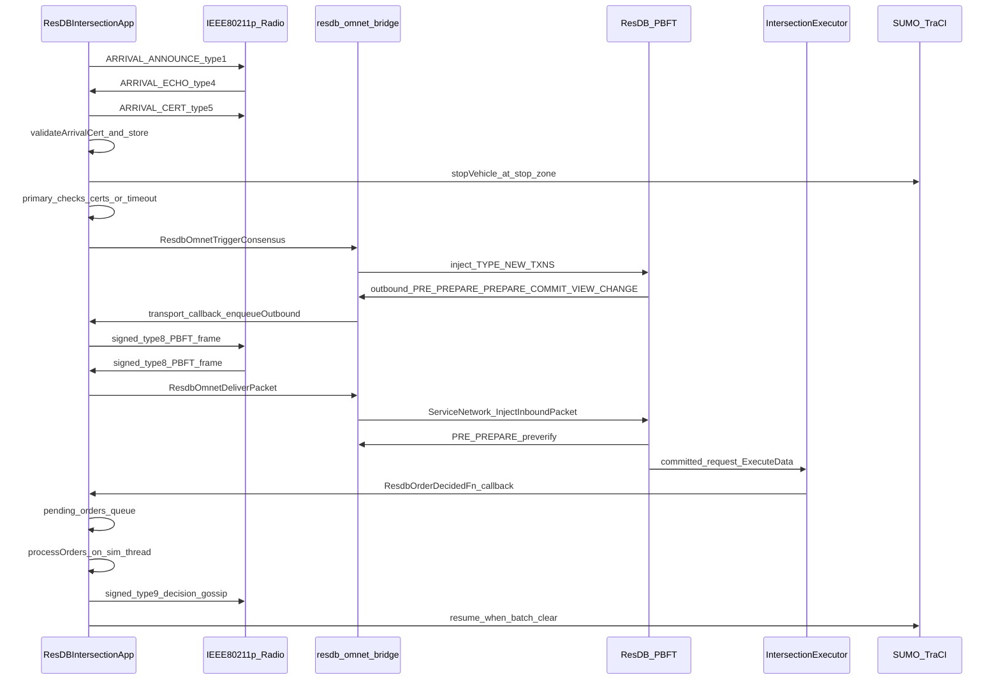

# System Architecture: ResDB-over-Veins V2V Intersection Coordination

This is the current architecture handoff for the V2V intersection coordination system. It reflects the migration from the old Java/BFT-SMaRt/JNI stack to the current C++ ResilientDB integration.

The canonical runtime path is:

```text
OMNeT++ / Veins vehicle app
  -> ResDBIntersectionApp C++ arrival-cert protocol
  -> ResilientDB PBFT through resdb_omnet_bridge
  -> 802.11p radio frames for all inter-vehicle traffic
  -> direct C++ order callback
  -> TraCI vehicle control
```

There is no Java or JNI consensus path on the current hot path. Older BFT-SMaRt files and docs are still useful as reference material, especially for the original arrival protocol, conflict matrix, verifier semantics, and leader-change research, but they are no longer the primary implementation.

---

## 1. Core Invariants

1. **Each vehicle is one PBFT replica.** `veh0` maps to ResDB replica `0`, `veh1` to replica `1`, and so on. ResDB's internal config still uses 1-based node ids, so the bridge translates between ResDB node id `N+1` and OMNeT replica id `N`.

2. **All inter-vehicle protocol traffic uses the Veins 802.11p radio model.** Arrival messages, ResDB PBFT bytes, view-change traffic, and decision gossip are carried as `BFTMessage` frames. ResDB is socketless in simulation mode.

3. **OMNeT++ owns simulated time.** `ResDBIntersectionApp` periodically calls `ResdbOmnetUpdateSimTimeUs()`. ResDB worker threads read `SimTimeProvider::NowUs()` and wait through `SimTimeProvider::SleepForUs()` / `SleepUntilUs()`.

4. **OMNeT++ simulation APIs are used only on the simulation thread.** ResDB worker threads enqueue outbound packets and committed orders. `ResDBIntersectionApp` drains those queues from self-messages.

5. **Witness certificates happen before consensus.** Physical arrival, lane verification, echo collection, and `ARRIVAL_CERT` validation happen in Veins C++ before the primary submits `ResdbProposeHdr + ResdbVehicleEntry[]` to PBFT.

6. **Consensus decides an order, not movement directly.** ResDB commits binary order bytes. `ResDBIntersectionApp::processOrders()` applies the order, waits for preceding batches to clear through TraCI, and then resumes the vehicle.

7. **Type 9 is now decision gossip.** In the legacy Java path, type 9 carried Java client-request broadcasts. In the current ResDB path, type 9 carries signed post-consensus order gossip so stragglers can catch up after missing the PBFT storm.

---

## 2. High-Level Node Model

Each simulated vehicle runs one `ResDBIntersectionApp` module. That module owns the vehicle's interaction with SUMO/TraCI, V2V arrival certificates, ResDB bridge lifecycle, radio transport, order delivery, and post-consensus gossip.

```text
Vehicle node i
|
+-- ResDBIntersectionApp
|   |
|   +-- TraCI helpers
|   |   +-- lane discovery
|   |   +-- stop-line distance
|   |   +-- stop / resume vehicle
|   |   +-- intersection-clearance checks
|   |
|   +-- Arrival certificate protocol
|   |   +-- ARRIVAL_ANNOUNCE type 1
|   |   +-- ARRIVAL_ECHO type 4
|   |   +-- ARRIVAL_CERT type 5
|   |
|   +-- ResDB bridge handle
|   |   +-- socketless ServiceNetwork
|   |   +-- OmnetConsensusManagerPBFT
|   |   +-- IntersectionExecutor
|   |   +-- order callback
|   |
|   +-- Radio transport
|   |   +-- outbound ResDB queue from worker threads
|   |   +-- signed type 8 PBFT radio frames
|   |   +-- inbound type 8 delivery to ResDB
|   |
|   +-- Decision gossip
|       +-- signed type 9 order broadcast
|       +-- f+1 matching gossip votes to apply missed order
|
+-- Veins NIC / 802.11p channel
```

The ResDB library still runs internal worker threads, but all interaction with Veins is mediated by the C bridge and callback queues. The app never includes internal ResDB C++ headers directly; it includes only `integration/omnet/resdb_omnet_bridge.h`.

---

## 3. Main Component Inventory

| File | Role |
|------|------|
| `veins-veins-5.3.1/src/veins/modules/application/resDB/ResDBIntersectionApp.h` | Main Veins app declaration. Defines phases, Byzantine modes, arrival-cert structs, transport queues, timers, gossip state, TraCI state, and ResDB callback hooks. |
| `veins-veins-5.3.1/src/veins/modules/application/resDB/ResDBIntersectionApp.cc` | Main app implementation. Owns initialization, timers, radio receive dispatch, arrival protocol, ResDB transport drain, `proposeAll()`, order processing, gossip, and fault injection. |
| `veins-veins-5.3.1/src/veins/modules/application/resDB/ResDBIntersectionApp.ned` | NED parameters for replica identity, ResDB paths, radio transport, jitter, cert timeout, gossip, view-change timeout, Byzantine injection, and TraCI behavior. |
| `veins-veins-5.3.1/src/veins/modules/application/resDB/IV2VTransport.h` | Minimal abstract transport interface. Provides C-compatible adapters for the bridge callback table. |
| `veins-veins-5.3.1/src/veins/modules/application/resDB/ResdbV2VWire.h` | Shared signed-envelope helper for type 8 and type 9 radio payloads. Layout is pubkey, signature length, DER ECDSA signature, then inner bytes. |
| `veins-veins-5.3.1/src/veins/modules/application/resDB/ResDBDecisionGossip.h/.cc` | Pure decision-gossip logic. Serializes `epoch || order_bytes`, parses gossip payloads, and counts matching votes by sender. |
| `veins-veins-5.3.1/src/veins/modules/application/resDB/ResDBTraCI.cc` | TraCI helpers extracted from the legacy V2V module: distance-to-lane-end, lane queue discovery, vehicle stop/resume helpers, and clearance detection. |
| `veins-veins-5.3.1/src/veins/modules/application/resDB/crypto/CryptoAuth.h/.cc` | OpenSSL ECDSA P-256 helper. Generates per-vehicle EC keys, signs arbitrary byte buffers, verifies signatures, and contains CA certificate helpers. |
| `incubator-resilientdb/integration/omnet/resdb_omnet_bridge.h` | C ABI between Veins and ResDB. Defines lifecycle, transport callback registration, sim-time update, consensus trigger, order callback, primary lookup, view-change hooks, and shared packed structs. |
| `incubator-resilientdb/integration/omnet/resdb_omnet_bridge.cc` | ResDB-side integration. Builds socketless PBFT service, installs OMNeT communicator, registers pre-verify function, hosts `IntersectionExecutor`, injects inbound packets, and exposes the C API. |
| `incubator-resilientdb/common/utils/sim_time_provider.h/.cpp` | Global simulated-time provider used by ResDB worker threads. Updated by the OMNeT simulation thread. |

---

## 4. End-to-End Flow



The key split is between ResDB worker threads and the OMNeT++ simulation thread. Worker threads may call transport callbacks and order callbacks. Those callbacks only enqueue data. Self-messages (`transport_poll_msg_`, `time_tick_msg_`, `clearance_poll_msg_`, and others) do the actual simulation work.

---

## 5. Runtime Lifecycle

### Stage 0 initialization

`ResDBIntersectionApp::initialize(stage == 0)` performs the system-level setup:

1. Reads NED parameters: replica id, total vehicles, ResDB config paths, radio settings, timeout settings, Byzantine mode, gossip settings, and TraCI behavior.
2. Binds `replicaId_` to the SUMO external id when possible. This keeps the PBFT replica id aligned with the SUMO vehicle id (`vehN`).
3. Generates the vehicle's ECDSA P-256 keypair through `CryptoAuth::generateKeyPair()`.
4. Creates either `VeinsTransport` or `LoggingTransport`.
5. Creates a real ResDB server handle with `ResdbOmnetCreateKvServer()` when config paths are present; otherwise creates a null handle.
6. Registers transport callbacks through `ResdbOmnetSetTransport()`.
7. Registers the order callback through `ResdbOmnetSetOrderCallback()`.
8. Configures the PBFT view-change timeout through `ResdbOmnetSetVcTimeoutUs()`.
9. Starts sim-time ticking through `ResdbOmnetUpdateSimTimeUs()`.
10. Runs the socketless ResDB server thread through `ResdbOmnetRunServer()`.
11. If `BYZANTINE_SILENT_PRIMARY` is enabled, calls `ResdbOmnetSetPbftSilent()` after the server starts.

### Stage 1 initialization

`initialize(stage == 1)` schedules the simulation behavior:

1. Optional smoke test for transport callbacks.
2. Staggered initial arrival announcement at `triggerJoinTimeSec + replicaId * arrivalSlotSec`.
3. Periodic arrival announcements until the car has broadcast its certificate or consensus starts.
4. Optional channel/SINR CSV metrics sampling.

### Teardown

`finish()` advances ResDB sim-time to a very large value before stopping the server. This wakes ResDB threads blocked in simulated sleeps. It then stops global stats, cancels VC timers, stops and destroys the ResDB handle, and tears down channel metrics.

---

## 6. V2V Message Type Registry

All inter-vehicle traffic is carried in `BFTMessage` packets over the Veins 802.11p channel.

| Type | Name | Current meaning | Payload |
|------|------|-----------------|---------|
| `1` | `ARRIVAL_ANNOUNCE` | Vehicle announces physical arrival, lane, position, direction, ambulance flag, epoch, and self-signature. | Text/pipe encoded arrival announcement plus signature bytes. |
| `4` | `ARRIVAL_ECHO` | Witness echo for a target car after TraCI verification. Currently broadcast at the MAC layer and filtered logically. | Text/pipe encoded echo with signer's compressed P-256 pubkey and ECDSA signature. |
| `5` | `ARRIVAL_CERT` | Vehicle broadcasts f+1 collected echoes as a participation certificate. | Text/pipe encoded cert with echo signer ids, pubkeys, and signatures. |
| `8` | ResDB PBFT bytes | ResDB PRE_PREPARE, PREPARE, COMMIT, VIEW_CHANGE, NEW_VIEW, and related PBFT traffic. | `resdbwire` signed wrapper around serialized ResDB bytes. |
| `9` | Decision gossip | Post-consensus order dissemination for stragglers that missed PBFT delivery. | `resdbwire` signed wrapper around `epoch || order_bytes`. |

Important legacy note: type `9` used to mean Java/BFT-SMaRt client-request broadcast in the JNI architecture. In the current ResDB architecture it is not a client request; it is post-consensus decision gossip.

---

## 7. Wire Formats

### Signed radio wrapper for type 8 and type 9

Defined in `ResdbV2VWire.h`:

```text
[33 bytes sender_pub_key_compressed]
[1 byte  sig_len]
[sig_len bytes DER ECDSA_SHA256(signature over inner bytes)]
[inner bytes]
```

For type `8`, inner bytes are serialized ResDB network bytes. For type `9`, inner bytes are decision-gossip bytes.

Inbound type `8` and type `9` messages are dropped if:

1. The signed packet cannot be parsed.
2. The inner byte length is zero.
3. `CryptoAuth::verifyBytes(pubKey, innerBytes, sig)` fails.

The wrapper proves that the inner bytes were signed by the included P-256 public key. The current code does not maintain a separate pubkey-to-replica registry, so this is an integrity check for the radio envelope rather than a complete identity-binding layer. ResDB's built-in node signature verifier is disabled in the simulation bridge because the bridge uses this P-256 wrapper and socketless injection instead.

### Consensus proposal payload

Defined in `resdb_omnet_bridge.h` and passed to `ResdbOmnetTriggerConsensus()`:

```c
#pragma pack(push, 1)
typedef struct ResdbVehicleEntry {
    int32_t  replica_id;
    uint64_t sim_time_us;
    uint8_t  is_ambulance;
    uint8_t  lane;
    uint8_t  direction;
    uint8_t  position_in_lane;
    uint8_t  cyber_status;
} ResdbVehicleEntry;  // 17 bytes

typedef struct ResdbProposeHdr {
    uint32_t epoch;
    int32_t  leader_id;
    uint64_t propose_sim_time_us;
    uint32_t n_vehicles;
} ResdbProposeHdr;  // 20 bytes
#pragma pack(pop)
```

The full proposal is:

```text
ResdbProposeHdr
ResdbVehicleEntry[hdr.n_vehicles]
```

Field semantics:

| Field | Meaning |
|-------|---------|
| `replica_id` | Vehicle/replica id, 0-based. |
| `sim_time_us` | Sim-time when the vehicle entered the stop zone or was observed. `UINT64_MAX` marks a QUIET synthetic entry. |
| `is_ambulance` | `1` for ambulance priority, `0` otherwise. Current announce path still trusts this flag from the arrival announcement. |
| `lane` | `0=N`, `1=S`, `2=E`, `3=W`. |
| `direction` | `0=Straight`, `1=Left`, `2=Right`. |
| `position_in_lane` | `1` is the front vehicle in its lane. Larger values are farther back. |
| `cyber_status` | `1=SIGNED` when an f+1 arrival cert exists. `0=QUIET` when no f+1 cert was available by proposal time. |

### Order decision payload

Defined in `resdb_omnet_bridge.h` and delivered through `ResdbOrderDecidedFn`:

```c
#pragma pack(push, 1)
typedef struct ResdbVehicleDecision {
    int32_t  replica_id;
    uint32_t batch_index;
} ResdbVehicleDecision;  // 8 bytes

typedef struct ResdbOrderHdr {
    uint32_t epoch;
    uint32_t n_vehicles;
    uint32_t n_batches;
} ResdbOrderHdr;  // 12 bytes
#pragma pack(pop)
```

The full order is:

```text
ResdbOrderHdr
ResdbVehicleDecision[hdr.n_vehicles]
```

`batch_index` is 0-based. Vehicles with the same `batch_index` may cross together. Vehicles in batch `k > 0` wait until all vehicles in batch `k - 1` have cleared the conflict region according to TraCI.

### Decision gossip payload

Defined in `ResDBDecisionGossip.h/.cc`:

```text
uint32_t epoch
uint8_t  order_bytes[]
```

The gossip payload is then wrapped in the same `resdbwire` signed wrapper used by type `8`.

---

## 8. Arrival Certificate Protocol

The arrival-cert protocol is the physical-world firewall before PBFT. It proves that a vehicle was observed by enough independent replicas before the consensus primary can schedule it as SIGNED.

### Phase A: Arrival announcement

Each vehicle periodically broadcasts `ARRIVAL_ANNOUNCE` (`messageType = 1`) until it has broadcast its cert or consensus has started.

The announcement contains:

```text
carId
laneId
cardinal lane
positionInLane
direction
isAmbulance
claimedArrivalTime
epoch
ambulanceCertBytes
ambulanceSigBytes
self signature
```

The self-signature covers:

```text
carId:laneId:positionInLane:claimedArrivalTime:epoch
```

The current wire format carries this self-signature, but the receive path does not use it as the main admission check. Witnesses decide whether to echo based on TraCI lane verification.

### Phase B: Witness echo

When a replica receives an announcement:

1. It ignores departed/zombie vehicles.
2. It parses the announcement.
3. It checks whether it has already verified and echoed the car.
4. It calls `verifyCarPosition(carId, laneId, positionInLane, tolerance)` using TraCI.
5. If the car is physically present but lying about lane, the receiver records the car but does not echo.
6. If verification passes, it stores a `VehicleState`, records physical observation, and broadcasts an `ARRIVAL_ECHO`.

The echo signature covers:

```text
carId:lane:positionInLane:direction:isAmbulance:echoingReplicaId
```

Each echo includes the signer's compressed P-256 public key and DER ECDSA signature.

### Phase C: Arrival certificate

The target vehicle collects echoes for itself. Once it has at least `f + 1` distinct echoes, where `f = (N - 1) / 3`, it assembles and broadcasts an `ARRIVAL_CERT` (`messageType = 5`).

Every receiver validates the cert before storing it:

1. The cert must contain at least `f + 1` echoes.
2. Echo signers must be distinct.
3. Each echo signature must verify against the embedded signer pubkey.
4. The signed string must match the cert's car, lane, position, direction, ambulance flag, and echoing replica id.

If validation passes, the receiver stores `collected_certs_[carId] = cert`.

### Certificate retries

If enabled by `enableArrivalCertRetries`, a vehicle rebroadcasts its assembled cert every `arrivalCertRetryIntervalSec` until one of these happens:

1. `arrivalCertRetryMax` is reached, unless `0` means unlimited.
2. `proposeAll()` runs.
3. An order is applied.
4. A type `8` PBFT frame from the current primary is observed.

This improves visibility of type `5` certificates without adding TCP-like ACK machinery.

### QUIET entries

If the primary reaches proposal time without a valid cert for every replica id, it pads missing vehicles as QUIET:

```text
sim_time_us = UINT64_MAX
cyber_status = 0
is_ambulance = 0
direction = 0
```

If the primary has local physical state for that vehicle, it still fills lane and position from that state. QUIET vehicles are isolated by the executor into singleton batches.

---

## 9. ResDB Bridge and Socketless PBFT

The C bridge is the only dependency boundary between Veins and ResDB. Veins includes `resdb_omnet_bridge.h` and calls C functions. Internal ResDB C++ headers stay on the ResDB side.

### Server creation

`ResdbOmnetCreateKvServer()`:

1. Loads ResDB config, private key, and cert paths.
2. Disables heartbeat.
3. Disables ResDB's built-in signature verifier.
4. Creates `OmnetConsensusManagerPBFT`.
5. Installs the PRE_PREPARE pre-verify lambda.
6. Creates `ServiceNetwork` with `enable_network_acceptor = false`.
7. Activates `SimTimeProvider` with a non-zero sentinel.
8. Stores pointers to the consensus manager and `IntersectionExecutor` in `ResdbOmnetServerHandle`.

Because `ServiceNetwork` has no acceptor, ResDB does not bind real sockets for consensus traffic in the simulation path.

### Transport callbacks

`ResDBIntersectionApp::registerTransport()` fills:

```c
ResdbOmnetTransportCallbacks {
    send_to,
    broadcast,
    ctx
}
```

The bridge's `OmnetReplicaCommunicator` calls those callbacks whenever ResDB wants to send PBFT messages. In the radio-backed path, the callback object is `VeinsTransport`, which calls `ResDBIntersectionApp::enqueueOutbound()`.

### Outbound radio path

ResDB worker thread:

```text
PBFT sends protobuf message
  -> OmnetReplicaCommunicator serializes ResDBMessage
  -> transport callback
  -> ResDBIntersectionApp::enqueueOutbound()
```

OMNeT simulation thread:

```text
transport_poll_msg_
  -> drainOutboundQueue()
  -> resdbwire::packSignedPacket()
  -> BFTMessage type 8
  -> sendDelayedDown()
```

`enqueueOutbound()` deduplicates identical outbound byte strings. This matters because some ResDB send paths call per-recipient send functions for the same logical broadcast. In the V2V model, identical per-recipient sends collapse to one broadcast frame.

### Inbound radio path

```text
onWSM()
  -> filter messageType == 8
  -> parse signed wrapper
  -> verify P-256 signature
  -> ResdbOmnetDeliverPacket(handle, fromReplicaId, innerBytes)
  -> ServiceNetwork::InjectInboundPacket()
  -> normal ResDB ConsensusManager::Process() path
```

### Self-injection

`OmnetReplicaCommunicator::SendMessage()` also self-injects broadcast bytes into the local `ServiceNetwork`.

This is required because real TCP deployments count a replica's own votes, while the Veins MAC path filters self-broadcasts. Without self-injection, a replica can miss its own PREPARE/COMMIT contribution and stall below the `2f + 1` quorum.

### PBFT silent mode

`ResdbOmnetSetPbftSilent()` toggles `OmnetReplicaCommunicator::SetPbftSilent()`. When enabled, the node drops all outbound PBFT messages. This is used by the `BYZANTINE_SILENT_PRIMARY` fault to force followers into complaint/view-change behavior.

---

## 10. PRE_PREPARE Pre-Verify

The bridge registers a `SetPreVerifyFunc` lambda. This runs on ResDB PRE_PREPARE requests before a follower proceeds with voting.

Current checks:

1. Non-PRE_PREPARE requests pass through.
2. PRE_PREPARE data must parse as `BatchUserRequest`.
3. The batch must contain at least one user request.
4. Wrapped request data must contain a `ResdbProposeHdr`.
5. `hdr.n_vehicles` must equal the replica count from ResDB config.
6. Payload size must contain all `ResdbVehicleEntry` records.
7. Replica ids must be unique.
8. Replica ids must be in `[0, expected)`.
9. `sim_time_us` must be non-zero. `UINT64_MAX` is allowed as the QUIET sentinel.
10. `is_ambulance` must be boolean.
11. `cyber_status` must be `0` or `1`.
12. `leader_id` must be in range.

The log message currently says "all 8 checks ok", but these are structural and sanity checks on the binary proposal. They are not a full port of the old Java `OrderRequestVerifier`.

Cryptographic witness validity is enforced when type `5` certificates are stored through `validateArrivalCert()`. The bridge pre-verify does not currently consult each follower's `collected_certs_` map, so the old Java cert-omission guard is not fully replicated.

---

## 11. `proposeAll()` and Proposal Construction

Only the current ResDB PBFT primary should submit a proposal under normal operation:

```text
replicaId_ == ResdbOmnetGetPrimary(resdb_server_handle_)
```

`proposeAll()`:

1. Stops cert rebroadcast retries.
2. Marks `propose_submitted_ = true`.
3. Records `ProposeAll_Submit_Time`.
4. Ensures the local vehicle has at least a minimal self entry.
5. Converts each collected cert into a SIGNED `ResdbVehicleEntry`.
6. Pads missing replica ids with QUIET `ResdbVehicleEntry` records.
7. Builds `ResdbProposeHdr + ResdbVehicleEntry[]`.
8. Applies Byzantine primary corruption if enabled.
9. Calls `ResdbOmnetTriggerConsensus()`.

For SIGNED entries, lane, direction, position, ambulance flag, and vehicle identity come from the stored cert and local vehicle state. For QUIET entries, the app uses locally observed lane/position if available and marks the cyber fields as unknown/quiet.

`ResdbOmnetTriggerConsensus()` wraps the proposal as a ResDB client request, then injects it into the local socketless `ServiceNetwork` as `TYPE_NEW_TXNS`.

---

## 12. `IntersectionExecutor` and Scheduling

`IntersectionExecutor` lives in `resdb_omnet_bridge.cc` and subclasses `resdb::TransactionManager`. Its `ExecuteData()` method is the ResDB-side smart contract for intersection scheduling.

Execution steps:

1. Parse `ResdbProposeHdr`.
2. Parse `ResdbVehicleEntry[]`.
3. Dump entries for diagnostics.
4. Build a work queue with ambulance-lane priority and lane-order constraints.
5. Repeatedly choose a schedulable head vehicle.
6. Grow the current batch with vehicles that are safe with every vehicle already in the batch.
7. Isolate QUIET entries as singleton batches.
8. Emit `ResdbOrderHdr + ResdbVehicleDecision[]`.
9. Invoke the registered `ResdbOrderDecidedFn` callback.

### Safety rules in the executor

`IsSafeToBatch()` is a C++ port of the Java `ConflictMatrix` safe-pair table. Same-lane vehicles are never batched together. Specific opposite-straight, right-turn, and right-turn-plus-opposite-straight pairs are allowed.

`AllSameLaneFrontPlaced()` preserves physical queue order. If another vehicle is ahead of the candidate in the same lane and has not yet been placed in a batch, the candidate cannot be selected as the next head.

`IsQuietEntry()` returns true when:

```text
cyber_status == 0 || sim_time_us == UINT64_MAX
```

QUIET entries never join another vehicle's batch and never accept another vehicle into their own batch. They become singleton batches.

### Ambulance behavior

The executor identifies ambulance vehicles and prioritizes vehicles blocking the ambulance's lane, followed by the ambulance itself. This flushes the ambulance lane while preserving front-of-lane ordering. Non-QUIET ambulance vehicles can still co-batch with safe partners from other lanes.

---

## 13. Order Callback and Vehicle Movement

The ResDB executor calls `ResdbOrderDecidedFn` from a ResDB worker thread. `ResDBIntersectionApp::onOrderDecided()` must not touch OMNeT APIs. It copies the bytes and pushes them into `pending_orders_`.

`transport_poll_msg_` runs every `transportPollInterval` and calls:

```text
drainOutboundQueue()
processOrders()
primary-change polling
```

`processOrders()`:

1. Swaps `pending_orders_` into a local deque.
2. Parses `ResdbOrderHdr`.
3. Parses `ResdbVehicleDecision[]`.
4. Logs `Order_Decided_Time`.
5. Cancels VC, stop-sign, and consensus timeout self-messages.
6. Finds this replica's `batch_index`.
7. Marks `order_applied_ = true`.
8. Triggers decision gossip if enabled.
9. Sets phase to `EXECUTING`.
10. If batch index is `0`, resumes immediately.
11. If batch index is greater than `0`, starts `clearance_poll_msg_`.

### Clearance-gated batch movement

For batch `k > 0`, the app gathers all vehicles in batch `k - 1` into `preceding_batch_cars_`. The clearance poll checks:

```text
vehicleHasClearedIntersectionTraCI("veh" + precedingReplicaId)
```

The vehicle resumes when all preceding-batch cars have cleared. If `clearanceTimeoutSec` expires first, it logs a timeout and resumes as a safety fallback.

### Departure detection

During position updates, if the current phase is `EXECUTING` and the order has been applied, the app checks whether the local vehicle cleared the intersection. On success, it sets:

```text
current_phase_ = DEPARTED
cleared_time_ = simTime()
```

Departed vehicles ignore inbound V2V messages through the zombie filter in `onWSM()`.

---

## 14. Decision Gossip

Decision gossip is the new propagation layer for committed orders. Its job is to help a replica that missed enough type `8` PBFT traffic still learn the decided order from replicas that did commit.

### Sending

When `processOrders()` applies a committed order and `enableDecisionGossip` is true:

```text
triggerGossip(epoch, order_bytes)
```

`triggerGossip()`:

1. Stores `gossip_epoch_` and `gossip_order_bytes_`.
2. Serializes inner bytes as `epoch || order_bytes`.
3. Signs the inner bytes with `resdbwire::packSignedPacket()`.
4. Broadcasts a type `9` `BFTMessage`.
5. Schedules exponential retry through `gossip_timer_`.

Retries use:

```text
next_interval = decisionGossipInitialIntervalSec * (1 << gossip_retry_count_)
```

Retries stop when `decisionGossipMaxRetries` is reached or `stopGossip()` clears the order bytes.

### Receiving

`handleDecisionGossip()`:

1. Parses the signed wrapper.
2. Verifies the sender's P-256 signature over the inner gossip bytes.
3. Parses `epoch` and `order_bytes`.
4. If this replica already applied the same committed order and is not currently gossiping, it relays the order.
5. If no order is applied, it records the sender's vote in `GossipAccumulator`.
6. When `f + 1` distinct senders agree on identical `order_bytes` for the same epoch, it calls `applyGossipOrder()`.

`applyGossipOrder()` pushes the gossiped order bytes into the same `pending_orders_` queue used by the normal ResDB callback. This means gossiped decisions follow the same `processOrders()` path as PBFT-delivered decisions.

### Gossip threshold

The threshold is:

```text
f = (total_vehicles_ - 1) / 3
threshold = f + 1
```

This is intentionally lower than PBFT commit quorum. Gossip is not a replacement consensus protocol; it is a catch-up mechanism for a decision that has already been committed by at least one honest deciding replica. Requiring `f + 1` matching signed senders ensures at least one honest signer is included under the `N = 3f + 1` model.

---

## 15. Simulated Time

OMNeT++ simulated time is the source of truth. The bridge provides:

```c
int ResdbOmnetUpdateSimTimeUs(void* handle, int64_t now_us);
```

`ResDBIntersectionApp` schedules `time_tick_msg_` every `timeTickInterval` and calls:

```text
ResdbOmnetUpdateSimTimeUs(handle, simTime().inUnit(SIMTIME_US))
```

ResDB uses `SimTimeProvider`:

```cpp
SimTimeProvider::NowUs()
SimTimeProvider::UpdateNowUs(now_us)
SimTimeProvider::SleepUntilUs(deadline_us)
SimTimeProvider::SleepForUs(delta_us)
```

`UpdateNowUs()` wakes condition-variable waiters even when the supplied time does not advance, which helps worker threads waiting for "any tick" behavior.

During teardown, the app updates sim time to `INT64_MAX` / max uint time to unblock any ResDB worker sleeping on simulated deadlines before stopping the server thread.

---

## 16. View Change and Primary Failure

ResDB's built-in PBFT view-change is the intended replacement for the old BFT-SMaRt `RequestsTimer` / STOP / STOP_NACK stack.

The bridge exposes:

```c
int ResdbOmnetSetVcTimeoutUs(void* handle, int64_t timeout_us);
int ResdbOmnetForceViewChange(void* handle);
int ResdbOmnetGetPrimary(void* handle);
int ResdbOmnetSetPbftSilent(void* handle, int silent);
```

### App-level VC trigger

When a follower enters the stop zone and no order arrives, it schedules `vc_trigger_msg_` for:

```text
certCollectionTimeoutSec + pbftVcTimeoutSec
```

When this fires, the app calls `ResdbOmnetForceViewChange()`. The bridge calls `ViewChangeManager::TriggerViewChangeNow()` through `OmnetConsensusManagerPBFT::TriggerViewChange()`.

This app-level trigger is a safety valve for simulation progress and Byzantine-primary experiments. It does not replace PBFT correctness; it pushes the ResDB view-change machinery to run.

### Primary change polling

Every transport poll, the app checks:

```text
current_primary = ResdbOmnetGetPrimary(handle)
```

If the primary changed and the new primary is this replica, and no order has been applied/submitted for this replica, it calls `proposeAll()` again. This allows a newly elected primary to propose after view change.

### Silent primary mode

`BYZANTINE_SILENT_PRIMARY` has two effects:

1. `proposeAll()` suppresses the client proposal.
2. After `ResdbOmnetRunServer()`, the app calls `ResdbOmnetSetPbftSilent(handle, 1)` so the ResDB communicator drops outbound PBFT messages.

This creates a realistic primary-silence fault at both app and PBFT transport levels.

### Bad proposal mode

`BYZANTINE_BAD_PROPOSAL` corrupts `hdr.n_vehicles` before calling `ResdbOmnetTriggerConsensus()`. Followers reject the malformed PRE_PREPARE in the bridge pre-verify path.

---

## 17. Byzantine Fault Model

The system assumes:

```text
N = 3f + 1
quorum = 2f + 1
arrival cert threshold = f + 1
decision gossip threshold = f + 1
```

Examples:

| N | f | PBFT quorum | Cert/gossip threshold |
|---|---|-------------|-----------------------|
| 4 | 1 | 3 | 2 |
| 12 | 3 | 7 | 4 |
| 16 | 5 | 11 | 6 |

### Current fault injection modes

| `byzantineType` | Name | Behavior | Defense / expected effect |
|-----------------|------|----------|---------------------------|
| `0` | Honest | Normal behavior. | Not a fault. |
| `1` | `FALSE_LANE` | Vehicle claims a fake lane in `ARRIVAL_ANNOUNCE`. | Honest witnesses fail TraCI verification and refuse to echo. Vehicle becomes QUIET if it cannot assemble f+1 echoes. |
| `2` | `INVALID_SIG` | Vehicle corrupts echo signatures with garbage bytes. | `validateArrivalCert()` rejects those echoes. With enough honest witnesses, other cars still collect f+1 valid echoes. |
| `3` | `EQUIVOCATOR` | Vehicle sends different directions to different peers. | Echo signatures diverge by direction; cert validity depends on f+1 echoes agreeing on the cert fields. |
| `4` | `SILENT_PRIMARY` | Primary suppresses app proposal and drops outbound PBFT messages. | Followers' VC triggers force ResDB view-change; new primary should propose. |
| `5` | `BAD_PROPOSAL` | Primary corrupts proposal shape. | Bridge pre-verify rejects PRE_PREPARE; view-change path should recover. |

### Current defenses

| Threat | Current defense |
|--------|-----------------|
| False physical lane | TraCI verification before echo. |
| Forged arrival cert | f+1 distinct ECDSA echo signatures checked in `validateArrivalCert()`. |
| Malformed binary proposal | Bridge PRE_PREPARE pre-verify. |
| Unsafe co-batching | Executor `IsSafeToBatch()` conflict matrix port. |
| Same-lane rear crossing before front | Executor `AllSameLaneFrontPlaced()`. |
| Missing cert at proposal deadline | QUIET padding and singleton batch isolation. |
| Missed PBFT decision | Type 9 decision gossip with f+1 matching signed senders. |
| Primary silence | PBFT silent fault plus app-level forced view-change. |

---

## 18. Important NED Parameters

Defined in `ResDBIntersectionApp.ned`.

### Identity and ResDB config

| Parameter | Meaning |
|-----------|---------|
| `replicaId` | Initial replica id. May be overridden from SUMO external id. |
| `resdbConfigFile` | Explicit ResDB `server.config`. |
| `resdbPrivateKeyFile` | Explicit ResDB private key path. |
| `resdbCertFile` | Explicit ResDB cert path. |
| `resdbLogDir` | Log directory. |
| `resdbCryptoDir` | If set, auto-fills config/key/cert/log paths. |

### Radio and timing

| Parameter | Meaning |
|-----------|---------|
| `useRadioTransport` | Use Veins radio-backed transport instead of logging transport. |
| `transportPollInterval` | Self-message interval for draining outbound PBFT and processing orders. |
| `timeTickInterval` | Sim-time update cadence for ResDB. |
| `viewJitterMin`, `viewJitterMax` | Jitter for arrival echo/cert style traffic. |
| `viewAgreementSlotSec` | Per-replica echo slot. |
| `broadcastJitterMin`, `broadcastJitterMax` | Broadcast jitter. |
| `broadcastSlotSec` | Per-replica slot for generic broadcasts, including type 8. |

### Cert collection and proposal

| Parameter | Meaning |
|-----------|---------|
| `triggerJoinTimeSec` | Initial arrival announcement start time. |
| `arrivalSlotSec` | Per-replica stagger for announcements and some cert sends. |
| `broadcastArrivalAnnouncementIntervalSec` | Periodic re-announcement interval. |
| `certCollectionTimeoutSec` | Primary's wait for certs before proposing with QUIET padding. |
| `enableArrivalCertRetries` | Enables repeated type 5 cert broadcasts. |
| `arrivalCertRetryIntervalSec` | Cert retry interval. |
| `arrivalCertRetryMax` | Number of extra cert retries; `0` means unlimited until stopped by another condition. |

### Crossing behavior

| Parameter | Meaning |
|-----------|---------|
| `stopDistance` | Stop-zone trigger distance to lane end. Code multiplies this by `totalVehicles / 2`. |
| `totalVehicles` | Number of vehicles/replicas expected in the scenario. |
| `cruiseSpeedMps` | Speed applied on resume. |
| `clearancePollPeriodSec` | Poll interval while waiting for previous batch to clear. |
| `clearanceTimeoutSec` | Safety timeout for clearance wait. |
| `stopSignTimeoutSec` | App-level safety release if no order arrives. |
| `consensusTimeoutSec` | Longer app-level fallback timeout. |

### Faults, gossip, and view change

| Parameter | Meaning |
|-----------|---------|
| `isByzantine` | Enables Byzantine behavior for this vehicle. |
| `byzantineType` | Fault type `0` through `5`. |
| `enableDecisionGossip` | Enables type 9 decision gossip. |
| `decisionGossipInitialIntervalSec` | First retry interval for gossip. |
| `decisionGossipMaxRetries` | Maximum gossip retries. |
| `pbftVcTimeoutSec` | Extra wait before app-level forced view-change. |
| `intendedDirection` | `S`, `L`, or `R`, used in announcements. |
| `intendedLane` | Optional `N/S/E/W` override to avoid SUMO lane-name ambiguity. |

---

## 19. Metrics and Logs

Common log markers used by benchmark scripts and debugging:

| Marker | Meaning |
|--------|---------|
| `[METRICS r] Stop_Time` | Vehicle entered stop zone. |
| `[METRICS r] ProposeAll_Submit_Time` | Primary submitted binary proposal to ResDB. |
| `[METRICS r] Order_Decided_Time` | App processed a committed/gossiped order. |
| `[METRICS r] Batch_Assignment` | Local vehicle's decided batch index. |
| `[METRICS r] Resume_Time` | Vehicle resumed movement. |
| `[CAR-METRICS]` | Per-car wait/departure summary. |
| `[TYPE8-DRAIN]` | Outbound signed PBFT bytes sent to radio. |
| `[TYPE8-RECV]` | Inbound signed PBFT bytes verified and delivered. |
| `[GOSSIP-SEND]` | Type 9 order gossip broadcast. |
| `[GOSSIP-RECV]` | Type 9 order gossip vote received. |
| `[GOSSIP-APPLY]` | Replica applied an order through gossip catch-up. |
| `[VC-DEBUG]`, `[VC-TRIGGER]`, `[APP-VC]` | View-change instrumentation. |
| `[OMNET-PREVERIFY]` | Bridge PRE_PREPARE pre-verify result. |
| `[EXECUTOR]`, `[EXEC-CB]` | ResDB executor and order callback logs. |

---

## 20. Build and Run Handoff

When changing the bridge, rebuild ResDB first, then Veins.

Typical sequence:

```bash
cd incubator-resilientdb
bazel build //integration/omnet:resdb_omnet_bridge

cd ../veins-veins-5.3.1
make -j$(nproc)

cd ../fourway
runomnetnogui -c BFTOverV2VWithResilientDB
```

Some local environments use a custom Bazel output root, for example:

```bash
bazel --output_user_root=/tmp/bazel build //integration/omnet:resdb_omnet_bridge
```

Use the scenario configs in `fourway/omnetpp.ini` for honest, ambulance, batch, Byzantine follower, and Byzantine primary experiments.

---

## 21. Known Limitations and Technical Debt

### Multi-epoch reset is incomplete

`current_epoch_` is present, but full `resetForNextRound()` parity with the legacy V2V module is not implemented. Departed/zombie filtering exists, but a long scenario with multiple independent rounds needs more reset logic.

### `ResdbOmnetRemoveReplica()` is a stub

The bridge function currently returns success for non-null handles but does not remove or reconfigure a replica. Departed-replica cleanup and epoch reconfiguration remain future work.

### Ambulance certificate verification is not fully enforced in the announce path

`CryptoAuth` supports CA-issued `VehicleCert` verification, but `handleArrivalAnnouncement()` currently trusts `ann.isAmbulance` after TraCI position verification. A Byzantine vehicle can still claim ambulance priority unless the ambulance certificate path is completed.

### Java `OrderRequestVerifier` is not fully ported

The bridge pre-verify is structural. The executor enforces important scheduling invariants, but the old Java verifier's full semantic checks are not all replicated before voting. In particular:

1. Follower-local cert-omission guard is not wired into bridge pre-verify.
2. The bridge does not directly compare a leader-submitted schedule against a follower recomputation because scheduling happens after commit in `IntersectionExecutor`.
3. QUIET singleton behavior is enforced by executor batching, not by rejecting a malformed leader schedule.

This is acceptable for the current ResDB design because the leader proposes vehicle state and the deterministic executor computes the order after commit. It is still different from the old Java design where the leader proposed the schedule string and followers verified it before WRITE.

### App-level fallbacks are not PBFT proofs

`stopSignTimeoutSec` and `consensusTimeoutSec` release vehicles for simulation safety. They are not substitutes for PBFT view-change. Byzantine-primary correctness experiments should use the VC logs and type `8` view-change traffic, not fallback release alone.

### Transport-level ACKs are intentionally absent

The current design does not port Java `ReliableV2VMessaging` sequence maps, ACKs, or retransmit queues. It relies on:

1. MAC staggering and jitter.
2. PBFT phase messages as implicit acknowledgments.
3. Type `5` cert retries.
4. Type `9` decision gossip for post-commit catch-up.

This avoids ACK implosion on broadcast V2V channels, but it means lossy-radio behavior must be evaluated at the PBFT and gossip layers.

### Type 8 radio signatures are not a full replica identity registry

Type `8` and type `9` payloads are signed and verified with the public key embedded in the radio wrapper. That prevents accidental corruption and detects a forged signature for that embedded key, but the current code does not yet check that the embedded key is the expected key for `fromReplicaId`. A future hardening pass should add a pubkey registry or bind keys through the arrival/cert layer.

---

## 22. Legacy BFT-SMaRt / JNI Mapping

The old architecture is useful for comparison but is not the current hot path.

| Legacy Java/BFT-SMaRt concept | Current ResDB/C++ equivalent |
|-------------------------------|------------------------------|
| `V2VProxyModule` | `ResDBIntersectionApp` |
| JNI JVM lifecycle | Deleted from current consensus path |
| `IntersectionServer` / `ServiceReplica` | Socketless ResDB `ServiceNetwork` with `OmnetConsensusManagerPBFT` |
| `ServerRunner.triggerJoinForReplica()` | `ResdbOmnetTriggerConsensus()` |
| Java `TOMMessage` client request | Binary `ResdbProposeHdr + ResdbVehicleEntry[]` |
| Java type 9 client-request broadcast | Type 8 ResDB PBFT bytes; type 9 is now decision gossip |
| `V2VServersCommunicationLayer` | `OmnetReplicaCommunicator` + `VeinsTransport` callbacks |
| `ReliableV2VMessaging` | No direct port; jitter, PBFT phases, cert retries, and gossip provide current reliability strategy |
| `OrderScheduler` | `IntersectionExecutor::ExecuteData()` |
| `OrderRequestVerifier` | Bridge structural pre-verify plus executor invariants; not a full semantic pre-vote port |
| `notifyOrderDecided()` JNI callback | `ResdbOrderDecidedFn` C callback into `ResDBIntersectionApp::onOrderDecided()` |
| `SimulationClock.currentTimeMillis()` | `SimTimeProvider::NowUs()` updated by OMNeT++ |
| Java `RequestsTimer` STOP/STOP_NACK | ResDB PBFT view-change plus app-level forced VC trigger |
| Java `nativeGetFreshProposePayload()` after LC | New primary polling calls `proposeAll()` from current C++ cert state |

---

## 23. Agent Orientation Checklist

When continuing work on this system, first identify which layer owns the behavior:

1. **Physical arrival, lane truth, certs, and vehicle movement:** `ResDBIntersectionApp.cc` and `ResDBTraCI.cc`.
2. **Radio carriage and signed V2V wrappers:** `ResDBIntersectionApp.cc`, `ResdbV2VWire.h`, and `CryptoAuth`.
3. **PBFT integration and socketless ResDB behavior:** `resdb_omnet_bridge.cc`.
4. **Binary proposal/order ABI:** `resdb_omnet_bridge.h`.
5. **Post-consensus catch-up:** `ResDBDecisionGossip.h/.cc` plus `handleDecisionGossip()`.
6. **Consensus time behavior:** `SimTimeProvider` and `ResdbOmnetUpdateSimTimeUs()`.
7. **Experiment knobs:** `ResDBIntersectionApp.ned` and `fourway/omnetpp.ini`.

Before changing behavior, check whether the old Java docs describe an invariant that still matters. Then implement it in the current C++/ResDB ownership boundary rather than reintroducing Java/JNI assumptions.
