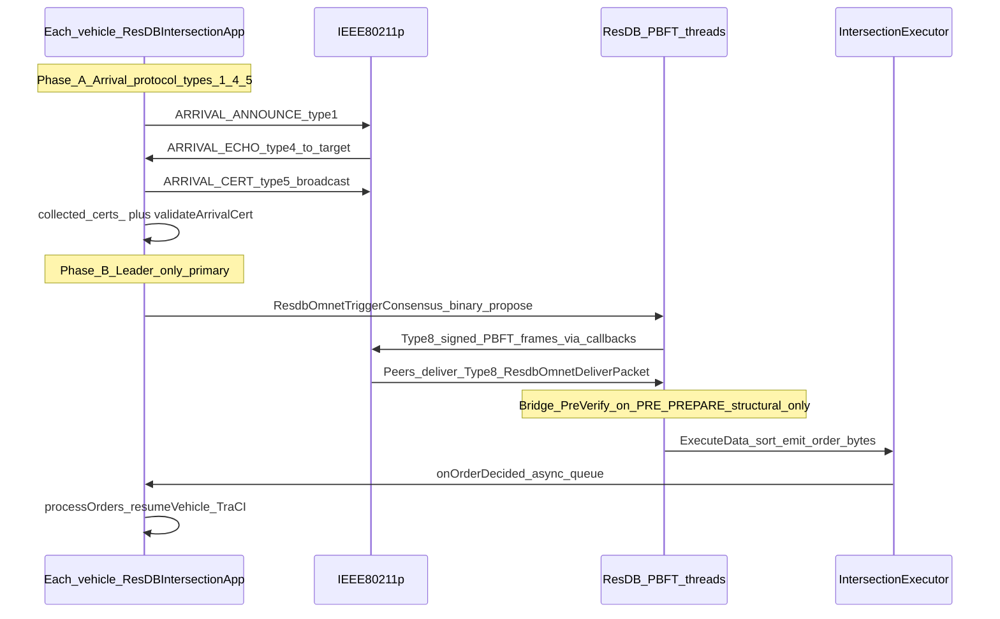

# ResDB + Veins architecture (current) vs legacy Java consensus

**Goal:** Preserve **the same intersection behavior as** [`V2VProxyModule`](../veins-veins-5.3.1/src/veins/modules/bftsmart/V2VProxyModule.cc) / [`V2VArrivalProtocol.cc`](../veins-veins-5.3.1/src/veins/modules/bftsmart/V2VArrivalProtocol.cc) for **physical arrival, echoes, certs, and timing**, while replacing **only** the consensus engine: **BFT-SMaRt + JNI → ResilientDB PBFT in C++** embedded via [`resdb_omnet_bridge`](../incubator-resilientdb/integration/omnet/resdb_omnet_bridge.cc). No Java process for consensus on the hot path.

Detailed gaps and roadmap live in [`5stepplan.md`](5stepplan.md) (Known Issues / Remaining Gaps).

---

## 1. Legacy design (reference): Java + BFT-SMaRt + JNI

This is the **previous** end-to-end flow (kept for thesis comparison). Consensus ran in Java; Veins called JNI to inject client requests and receive decisions.

**Phase 1 — Arrival / certs (C++ in Veins):** unchanged conceptually:

```
Car i → ARRIVAL_ANNOUNCE (type 1, broadcast)
     → witnesses → ARRIVAL_ECHO (type 4, unicast to i)
     → car i collects f+1 echoes → ARRIVAL_CERT (type 5, broadcast)
     → each replica stores ArrivalCert in collectedCerts
```

**Phase 2–5 — PROPOSE_ALL, scheduling, verification, delivery:** Java `IntersectionServer`, BFT-SMaRt `TOMMessage`, `OrderRequestVerifier` (ConflictMatrix, QUIET batches, eight semantic checks on the **string** proposal), JNI `notifyOrderDecided` → `V2VProxyModule::handleOrderDecision`. Radio carried **type 9** client-request broadcasts after Java serialized `TOMMessage`.

**Leader-change / EP5:** Driven by Java `RequestsTimer`, STOP / STOP_NACK, `Synchronizer` — not replicated in the ResDB Veins app today (see §6).

---

## 2. Current stack (canonical)

| Piece | Role |
|--------|------|
| [`ResDBIntersectionApp`](../veins-veins-5.3.1/src/veins/modules/application/resDB/ResDBIntersectionApp.cc) | Veins application: **same arrival protocol types 1/4/5** as V2V; TraCI verify; **binary** propose via `ResdbOmnetTriggerConsensus`; receives orders via callback queue |
| [`resdb_omnet_bridge.cc`](../incubator-resilientdb/integration/omnet/resdb_omnet_bridge.cc) | Starts ResDB `ServiceNetwork` **without TCP**; wires **OmnetReplicaCommunicator** to Veins callbacks; registers **`SetPreVerifyFunc`** on PRE_PREPARE; hosts **`IntersectionExecutor`** |
| PBFT + sim time | [`ResdbOmnetUpdateSimTimeUs`](../incubator-resilientdb/integration/omnet/resdb_omnet_bridge.cc), worker threads + simulation-thread delivery |
| **IntersectionExecutor** | `ExecuteData`: parses **`ResdbProposeHdr` + `ResdbVehicleEntry[]`**, sorts by ambulance + `sim_time_us`, emits **`ResdbOrderHdr` + replica ids**; invokes `ResdbOrderDecidedFn` |

**Wire message types (Veins `BFTMessage`):**

| Type | Name | Notes |
|------|------|--------|
| 1 | ARRIVAL_ANNOUNCE | Broadcast; same pipe/hex style as `V2VArrivalProtocol` |
| 4 | ARRIVAL_ECHO | Logical unicast via `toReplicaId`; still **802.11 broadcast MAC** with staggered `sendDelayedDown` |
| 5 | ARRIVAL_CERT | Broadcast; validated in **`validateArrivalCert`** before store |
| 8 | ResDB PBFT | **`resdbwire` signed** payload; **`drainOutboundQueue`** for outbound |

---

## 3. End-to-end flow (ResDB) — one diagram



---

## 4. Phase A — Arrival protocol (C++ only, V2V-aligned)

Implementation: **[`ResDBIntersectionApp.cc`](../veins-veins-5.3.1/src/veins/modules/application/resDB/ResDBIntersectionApp.cc)** (serialization helpers mirror **`V2VArrivalProtocol.cc`**).

1. **ARRIVAL_ANNOUNCE (1):** Broadcast on schedule / trigger; TraCI-backed lane; ECDSA self-sign on announce fields.
2. **ARRIVAL_ECHO (4):** After **`verifyCarPosition`** (lane + tolerance); ECDSA over `carId:lane:pos:dir:isAmb:echoingReplicaId`.
3. **ARRIVAL_CERT (5):** After **f+1** distinct valid echoes for **this** car; broadcast; **`validateArrivalCert`** verifies echo signatures (same string as send-side).

**MAC staggering:** [`sendBFTMessage`](../veins-veins-5.3.1/src/veins/modules/application/resDB/ResDBIntersectionApp.cc) uses **`sendDelayedDown`** (not bare `sendDown`):

- **Echo:** `replicaId * viewAgreementSlotSec + uniform(viewJitterMin, viewJitterMax)`
- **Cert:** `uniform(viewJitterMin, viewJitterMax)` (per-send jitter)
- **Announce:** `replicaId * arrivalSlotSec + uniform(broadcastJitterMin, broadcastJitterMax)`

NED knobs match **`V2VProxyModule.ned` / `V2VReliability.cc`** conceptually — see [`ResDBIntersectionApp.ned`](../veins-veins-5.3.1/src/veins/modules/application/resDB/ResDBIntersectionApp.ned).

**Cert collection deadline (leader):**

- **`tryStartCertCollectionTimer()`** arms **`cert_collection_timeout_`** on the **first** leader observation (self-announce or peer **`handleArrivalAnnouncement`**, including FALSE_LANE observation path) — aligned with V2V starting the timer at first physical observation.
- **Stop zone:** If certs already complete → **`proposeAll()`** immediately. Else if the deadline timer was **not** already armed → schedule once from stop entry. **Do not** stack a second full timeout if the approach timer is already running.
- If the deadline fires **before** the vehicle enters the stop zone → **`deferred_propose_after_cert_timeout_`**; **`proposeAll()`** runs when the stop line is entered (**no** V2V-style **0.5 s** reschedule loop).

**ARRIVAL_CERT retries:** Optional **`cert_retry_timer_`**: rebroadcast the **same** assembled cert every **`arrivalCertRetryIntervalSec`**, up to **`arrivalCertRetryMax`** (0 = unlimited until stopped). Stops on **`proposeAll()`**, **`order_applied_`**, or **first type-8 frame from the current primary** (consensus started). Params: `enableArrivalCertRetries`, `arrivalCertRetryIntervalSec`, `arrivalCertRetryMax`.

**Debug:** `debugCertProtocol` enables `[CERT-DEBUG]` traces.

---

## 5. Phase B — Propose (leader / binary, no Java string)

**Who proposes:** Replica **`replicaId == ResdbOmnetGetPrimary(handle)`** — ResDB’s **global PBFT primary**, not `amITheLeader(physicallyObservedCars)` from V2V (see parity table).

**Payload:** [`proposeAll()`](../veins-veins-5.3.1/src/veins/modules/application/resDB/ResDBIntersectionApp.cc) builds **`ResdbProposeHdr`** + one **`ResdbVehicleEntry`** per entry derived from **`collected_certs_`** (plus minimal **self-cert** insert if missing). This is **not** the legacy `"PROPOSE_ALL:…"` string.

**Submission:** **`ResdbOmnetTriggerConsensus`** injects the client request into the **local** ResDB replica (primary only in normal operation).

---

## 6. Phase C — PBFT on the radio (type 8)

Outbound PBFT bytes are **queued** → **`drainOutboundQueue`** signs with **`resdbwire::packSignedPacket`** → **`BFTMessage`** **`messageType = 8`** → **`sendDelayedDown`** with **`resdbBroadcastJitterMin/Max`**.

Inbound: **`onWSM`** unpacks signed envelope, verifies ECDSA, **`ResdbOmnetDeliverPacket(fromReplicaId, innerBytes)`**.

---

## 7. Phase D — “PreVerify” (bridge): structural only

**Important:** This is **not** the Java **`OrderRequestVerifier`** (no ConflictMatrix / QUIET batch semantics / eight semantic checks on the scheduling string).

[`SetPreVerifyFunc`](../incubator-resilientdb/integration/omnet/resdb_omnet_bridge.cc) (approximately lines **259–355**) validates **PRE_PREPARE** `request.data()`:

- Parse **`BatchUserRequest`**
- **`ResdbProposeHdr` + `n_vehicles * sizeof(ResdbVehicleEntry)`** size checks
- **`hdr.n_vehicles == replica_count`** (must match cluster size — drives need for **QUIET padding** if certs missing; see [`5stepplan.md`](5stepplan.md) Gap 1)
- No duplicate **`replica_id`** entries; IDs in **`[0, expected)`**
- **`sim_time_us != 0`**, **`is_ambulance`** boolean sane
- **`leader_id`** in range

**Cryptographic witness validity** for intersection participation is enforced when storing **type 5** via **`validateArrivalCert`**, not in this lambda.

---

## 8. Phase E — Execute + decision delivery

**IntersectionExecutor::ExecuteData** sorts vehicles (ambulance first, then **`sim_time_us`**), builds binary order, invokes registered callback.

**[`onOrderDecided`](../veins-veins-5.3.1/src/veins/modules/application/resDB/ResDBIntersectionApp.cc)** enqueues bytes; **`processOrders`** (sim thread) parses **`ResdbOrderHdr`**, sets **`order_applied_`**, **`resumeVehicle(position)`**.

**Observed failure mode (debugging):** Logs may show **`TriggerConsensus … vehicles=4`** without **`Order_Decided_Time`** until **`StopSign_Timeout`** — points to **PBFT / type-8 delivery / commit / callback** path, not Phase A. See [`5stepplan.md`](5stepplan.md) debugging section.

---

## 9. Parity: V2VProxyModule vs ResDBIntersectionApp

| Area | V2VProxyModule | ResDBIntersectionApp (current) |
|------|----------------|----------------------------------|
| Arrival wire + echo sign string | `V2VArrivalProtocol` | Same algorithm + ported serializers |
| MAC stagger for 1/4/5 | `V2VReliability` `sendDelayedDown` | `sendBFTMessage` + NED jitter/slots |
| Cert timer start | First observation as leader | **`tryStartCertCollectionTimer`** |
| Timeout before stop | V2V reschedules **0.5 s** until stop | **Deferred propose** at stop (no spin loop) |
| Cert retransmit | Broad retx timer (`retxCheckTimer` etc.) | **ARRIVAL_CERT** retries only (optional) |
| Leader rule | `amITheLeader(physicallyObservedCars)` + lane topology | **Global ResDB primary** |
| Proposal body | Java `PROPOSE_ALL:` string + OrderScheduler | **Binary `ResdbProposeHdr` + entries** |
| Follower verify propose | Java **OrderRequestVerifier** (8 semantic checks) | Bridge **structural** PreVerify only |
| Execute ordering | Java OrderScheduler + ConflictMatrix | **Executor** sorts binary entries (no matrix in C++ yet) |
| JNI | Heavy | **None** on consensus path |

---

## 10. Leader-change / EP5 (legacy JNI)

The Java doc’s STOP / SYNC / `getFreshProposePayload` story is **not** wired through **`ResDBIntersectionApp`** today. ResDB uses **PBFT view-change** internally; making it **reproducible under OMNeT + RF** is the open integration problem (see **`5stepplan.md`** Gap 7 and milestones **4**). Background on LC over lossy V2V (BFT-SMaRt side): **[`LC_PROTOCOL_RESEARCH_SUMMARY.md`](../LC_PROTOCOL_RESEARCH_SUMMARY.md)**.

---

## 11. Related docs

- **[`5stepplan.md`](5stepplan.md)** — Step-by-step implementation plan; **Known Issues**, **Gaps**, **ResDB success milestones**, **Next Session** / **Debugging**, and **handoff bundle**.
- **[`RESDB_CODING_GUIDE.md`](RESDB_CODING_GUIDE.md)** — Where to add helpers (`ResDBTraCI`, new `.cc/.h` pairs); **do not** inflate `ResDBIntersectionApp.cc` without splitting (mirror [`V2VProxyModule`](../veins-veins-5.3.1/src/veins/modules/bftsmart/V2VProxyModule.cc) organization).
- **[`LC_PROTOCOL_RESEARCH_SUMMARY.md`](../LC_PROTOCOL_RESEARCH_SUMMARY.md)** — Leader-change over lossy V2V (Java/BFT-SMaRt); relevant **integration concepts** for **milestone 4** on the ResDB side (sim time, RF, VC phases).
